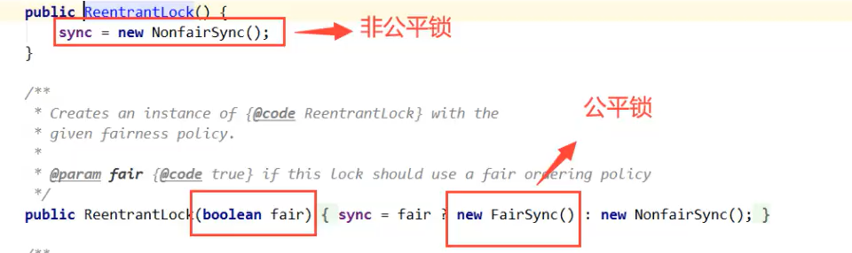
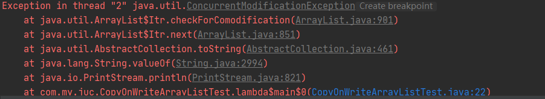
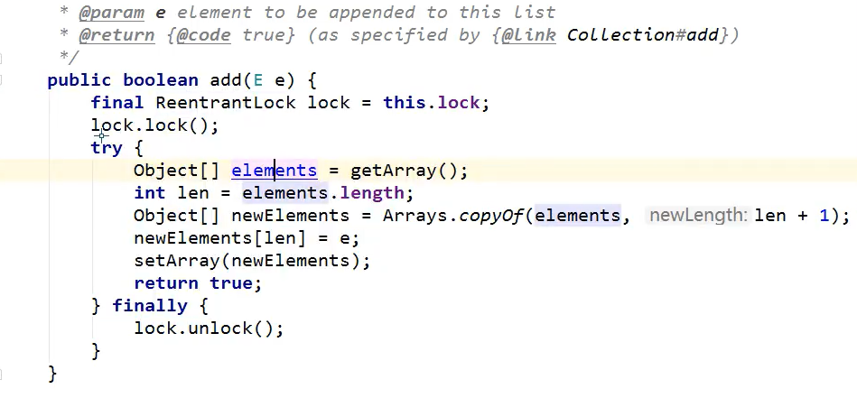
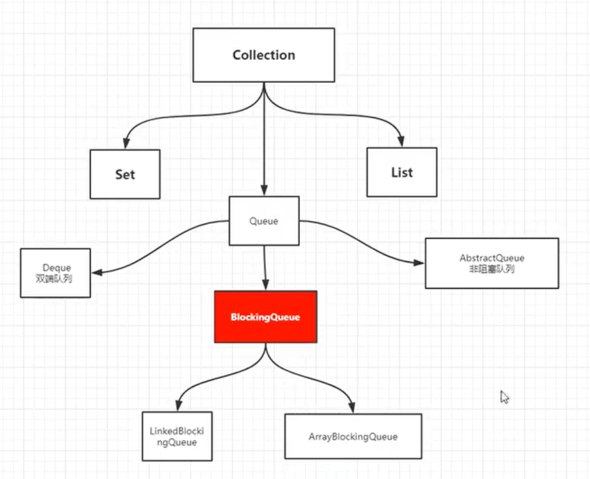
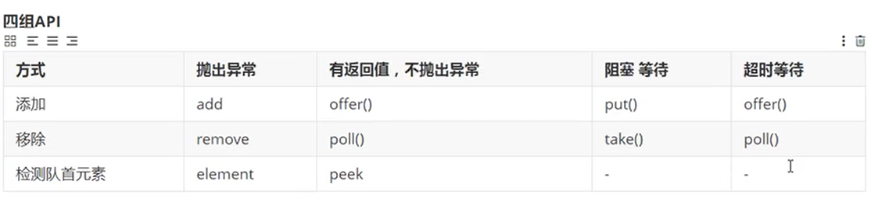
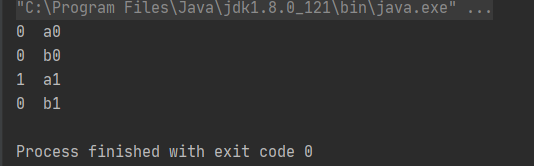

# JUC

```tip
JUC为 java.util.concurrent 包
```

## 一：线程和进程

```tip
进程：
进程是线程的容器
进程是系统资源分配的单位
进程之间的资源相互独立

线程：
线程依赖于进程
线程与线程之间可共享资源
```


## 二：wait和sleep

```tip
wait暂停时会释放资源，作用于同步代码块，属于Object类。
sleep暂停没有释放资源，属于Thread类
```


## 三： Lock锁



```tip
公平锁：先来后到
非公平锁： 可插队（默认）
```

```java
public class SaleTicket {

    public static void main(String[] args) {
        Ticket ticket = new Ticket();
        new Thread(()->{
            for (int i = 0; i < 50; i++) {
                ticket.sale();
            }
        }, "A").start();
        new Thread(()->{
            for (int i = 0; i < 50; i++) {
                ticket.sale();
            }
        }, "B").start();
        new Thread(()->{
            for (int i = 0; i < 50; i++) {
                ticket.sale();
            }
        }, "C").start();
    }
}
class Ticket {

    private int number = 50;
    Lock lock = new ReentrantLock();
    public void sale() {
        lock.lock();
        try {
            if(number > 0) {
                System.out.println(Thread.currentThread().getName() + "卖出第" + (number--) + "张票，剩余" + number);
            }
        } catch (Exception e) {

        } finally {
            lock.unlock();
        }

    }
}
```


## 四：Synchronized和Lock区别

```tip
1.Synchronized 是内置的java关键字， Lock是一个java类
2.Synchronized 无法判断获取锁的状态，Lock可以判断是否获取到了锁
3.Synchronized 会自动释放锁，lock必须要手动释放锁。不释放会变成死锁
4.Synchronized 线程1 获得锁，阻塞  线程2 等待  。   Lock锁不一定会继续等待
5.Synchronized 是可重入锁，不可以中断，非公平；Lock 也是可重入锁，可以判断锁，非公平（可以自己设置）
6.Synchronized 适合锁少量代码同步问题， Lock适合锁大量同步代码。

可重入锁又名递归锁，是指在同一个线程在外层方法获取锁的时候，再进入该线程的内层方法会自动获取锁（前提锁对象得是同一个对象或者class），不会因为之前已经获取过还没释放而阻塞。Java中ReentrantLock和synchronized都是可重入锁，可重入锁的一个优点是可一定程度避免死锁。

```

### <font color='red'>Lock锁比Synchronized锁要高效，具为何效率高未搞清楚。</font>

## 五：生产者消费者

```tip
1.虚假唤醒问题：
当一个条件满足时，很多线程都被唤醒了，但是只有其中部分是有用的唤醒，其它的唤醒都是无用功
1比如说买货，如果商品本来没有货物，突然进了一件商品，这时所有的线程都被唤醒了，
但是只能一个人买，所以其他人都是假唤醒，获取不到对象的锁
解决办法：
用while替代if判断。
因为if只会执行一次，执行完会接着向下执行if（）外边的
而while不会，直到条件满足才会向下执行while（）外边的

Synchronized 的等待通知方法为  wait、notifyall
Lock 的等待通知方法为  
Condition condition = lock.newCondition()
condition.await()
condition.signalAll()
```

### Condition 精准通知线程的唤醒

```java
public class ConditionTest {
    public static void main(String[] args) {
        Data data = new Data();
        new Thread(()->{
            for (int i = 0; i < 10; i++) {
                data.printA();
            }
        }, "A").start();
        new Thread(()->{
            for (int i = 0; i < 10; i++) {
                data.printB();
            }
        }, "B").start();
        new Thread(()->{
            for (int i = 0; i < 10; i++) {
                data.printC();
            }
        }, "C").start();
        new Thread(()->{
            for (int i = 0; i < 10; i++) {
                data.printD();
            }
        }, "D").start();
    }
}

class Data {
    private Lock lock = new ReentrantLock();
    private Condition condition1 = lock.newCondition();
    private Condition condition2 = lock.newCondition();
    private Condition condition3 = lock.newCondition();
    private Condition condition4 = lock.newCondition();
    private int number = 1;

    public void printA() {
        lock.lock();
        try {
            while (number != 1) {
                condition1.await();
            }
            System.out.println(Thread.currentThread().getName() + "=>AAAAAAAAAA");
            number = 0;
            condition2.signal();
        } catch (Exception e) {
            e.printStackTrace();
        } finally {
            lock.unlock();
        }
    }

    public void printB() {
        lock.lock();
        try {
            while (number != 0) {
                condition2.await();
            }
            System.out.println(Thread.currentThread().getName() + "=>BBBBBBBBBB");
            number = 1;
            condition3.signal();
        } catch (Exception e) {
            e.printStackTrace();
        } finally {
            lock.unlock();
        }
    }

    public void printC() {
        lock.lock();
        try {
            while (number != 1) {
                condition3.await();
            }
            System.out.println(Thread.currentThread().getName() + "=>CCCCCCCC");
            number = 0;
            condition4.signal();
        } catch (Exception e) {
            e.printStackTrace();
        } finally {
            lock.unlock();
        }
    }

    public void printD() {
        lock.lock();
        try {
            while (number != 0) {
                condition4.await();
            }
            System.out.println(Thread.currentThread().getName() + "=>DDDDDDDDD");
            number = 1;
            condition1.signal();
        } catch (Exception e) {
            e.printStackTrace();
        } finally {
            lock.unlock();
        }
    }
}
```

```tip
有时业务要求线程的执行顺序，但不同线程的条件（如number）却相同
此时可以为每个线程生成一个Condition condition = lock.newCondition();
然后再相应的代码块进行填充await方法和signal方法。
```

### Synchronized的问题

```tip
synchronized锁的对象是调用者。
静态static为全局唯一，
若锁的方法为静态，则调用者都是XXXX.class对象。
没有被锁的方法不受约束，可直接调用。
```

## 六：CopyOnWriteArrayList

```java
public static void main(String[] args) {
        // 并发下ArrayList不安全
        ArrayList<String> list = new ArrayList<>();

//        CopyOnWriteArrayList<String> list = new CopyOnWriteArrayList<>();

        for (int i = 0; i < 10; i++) {
            new Thread(()->{
                list.add(UUID.randomUUID().toString().substring(0,5));
                System.out.println(list);
            }, String.valueOf(i)).start();
        }
    }
```



```tip
ArrayList在多线程情况下是不安全的，会发生并发修改异常 java.util.ConcurrentModificationException
所以应该使用CopyOnWriteArrayList
```

```java
CopyOnWriteArrayList<String> list = new CopyOnWriteArrayList<>();

        for (int i = 0; i < 10; i++) {
            new Thread(()->{
                list.add(UUID.randomUUID().toString().substring(0,5));
                System.out.println(list);
            }, String.valueOf(i)).start();
        }
```



```tip
CopyOnWriteArrayList底层是使用Lock进行同步代码，保证集合安全
在写入时进行添加Lock，然后复制，进行读写分离，避免造成数据覆盖问题
CopyOnWriteArraySet也是相同

写入时复制（CopyOnWrite，简称COW）思想是计算机程序设计领域中的一种优化策略。其核心思想是，如果有多个调用者（Callers）同时要求相同的资源（如内存或者是磁盘上的数据存储），他们会共同获取相同的指针指向相同的资源，直到某个调用者视图修改资源内容时，系统才会真正复制一份专用副本（private copy）给该调用者，而其他调用者所见到的最初的资源仍然保持不变。这过程对其他的调用者都是透明的（transparently）。此做法主要的优点是如果调用者没有修改资源，就不会有副本（private copy）被创建，因此多个调用者只是读取操作时可以共享同一份资源。
```

## 七：ConcurrentHashMap

```java
public class ConcurrentHashMapTest {
    public static void main(String[] args) {

        ConcurrentHashMap<String, String> map = new ConcurrentHashMap<>();
        for (int i = 0; i < 20; i++) {
            new Thread(()->{
                map.put(Thread.currentThread().getName(), UUID.randomUUID().toString().substring(0,5));
                System.out.println(map);
            }, String.valueOf(i)).start();
        }
    }
}
```

### <font color='red'>ConcurrentHashMap底层原理尚未了解。</font>

## 八：Callable

```java
public class CallableTest {
    public static void main(String[] args) {

        MyThread myThread = new MyThread();
        FutureTask<MyThread> futureTask = new FutureTask<MyThread>(myThread);
        new Thread(futureTask, "a").start();
        new Thread(futureTask, "b").start();
        try {
            System.out.println(futureTask.get());
        } catch (InterruptedException e) {
            e.printStackTrace();
        } catch (ExecutionException e) {
            e.printStackTrace();
        }
    }
}
class MyThread implements Callable{

    @Override
    public Integer call() throws Exception {
        System.out.println("call()");
        return 1024;
    }
}
```

```tip
由于Thread类无法接受Callable的实现类，所以需要通过FutureTask适配类进行调整。
1.Callable有缓存
2.结果可能需要等待，会阻塞。
```

## 九：CountDownLatch CyclicBarrier

```java
public class CountDownLatchTest {
    public static void main(String[] args) {
        CountDownLatch countDownLatch = new CountDownLatch(6);

        for (int i = 0; i < 6; i++) {
            new Thread(()->{
                System.out.println(Thread.currentThread().getName() + " out");
                countDownLatch.countDown();
            }, String.valueOf(i)).start();
        }
        try {
            countDownLatch.await();
        } catch (InterruptedException e) {
            e.printStackTrace();
        } finally {
        }
        System.out.println("close");
    }
}
```

```tip
countDownLatch.countDown(); 数量减一
countDownLatch.await();   等待计数器归零，然后往下执行
countDown()每次减一，为0时 await()被唤醒继续执行。
```

```java
public class CycliBarrier {
    public static void main(String[] args) {
        CyclicBarrier barrier = new CyclicBarrier(7, () -> {
            System.out.println("success");
        });

        for (int i = 0; i < 7; i++) {
            final int temp = i;
            new Thread(()->{
                System.out.println(temp);
                try {
                    barrier.await();
                } catch (InterruptedException e) {
                    e.printStackTrace();
                } catch (BrokenBarrierException e) {
                    e.printStackTrace();
                } finally {
                }
            }).start();
        }

    }
}
```

```tip
CyclicBarrier与CountDownLatch相反，执行加操作
```


## 十：Semaphore

```java
public class SemaphoreTest {
    public static void main(String[] args) {
        // 线程数量，停车位  限流
        Semaphore semaphore = new Semaphore(3);

        for (int i = 0; i < 6; i++) {
            new Thread(()->{
                try {
                    semaphore.acquire();
                    System.out.println(Thread.currentThread().getName() + "get park");
                    TimeUnit.SECONDS.sleep(2);
                    System.out.println(Thread.currentThread().getName() + "leave");
                } catch (InterruptedException e) {
                    e.printStackTrace();
                } finally {
                    semaphore.release();
                }
            }, String.valueOf(i)).start();
        }
    }
}
```

```tip
acquire  获得资源 如果已经满了，等待
release 释放资源  信号量+1 唤醒等待的进程
作用：多个共享资源互斥的使用，并发限流，控制最大线程数量。
```

```tip
CountDownLatch CyclicBarrier  指定个数的线程执行完毕再执行操作
Semaphore  同一时间只能有指定数量得到线程
```

## 十一：ReadWriteLock

```java
public class ReadWriteLockTest {
    public static void main(String[] args) {
        MyCache myCache = new MyCache();

        for (int i = 0; i < 5; i++) {
            final int temp = i;
            new Thread(()->{
                myCache.put(temp + "",temp);
            }).start();
        }
        for (int i = 0; i < 5; i++) {
            final int temp = i;
            new Thread(()->{
                myCache.get(temp + "");
            }).start();
        }
    }
}
class MyCache{
    private volatile Map<String, Object> map =  new HashMap<>();
    private ReadWriteLock readWriteLock = new ReentrantReadWriteLock();

    public void put(String key,Object value) {
        readWriteLock.writeLock().lock();
        System.out.println(Thread.currentThread().getName() + "wirte" + key);
        map.put(key,value);
        System.out.println(Thread.currentThread().getName() + "write ok");
        readWriteLock.writeLock().unlock();
    }

    public void get(String key) {
        readWriteLock.readLock().lock();
        System.out.println(Thread.currentThread().getName() + "read" + key);
        map.get(key);
        System.out.println(Thread.currentThread().getName() + "read ok");
        readWriteLock.readLock().unlock();
    }
}
```

```tip
读写时若不加锁，则线程不安全，数据会出错
也可以加synchronized、lock
但ReadWriteLock可以更细粒度的控制，性能也更好。
独占锁（写锁）  一次只能被一个线程占有
共享锁（读锁）  多个线程可以同时占有
```

##   十二：阻塞队列

### 1.ArrayBlockingQueue






```java
public class BlockingQueueTest {
    public static void main(String[] args) throws InterruptedException {
        test();
    }
    public static void test() throws InterruptedException {
        ArrayBlockingQueue<Object> blockingQueue = new ArrayBlockingQueue<>(2);
        blockingQueue.offer("a");
        blockingQueue.offer("b");
        // 线程在此处暂停2s，等待其它线程操作
        blockingQueue.offer("c", 2, TimeUnit.SECONDS);

        System.out.println(blockingQueue.poll());
        System.out.println(blockingQueue.poll());
        // 线程在此处暂停2s，等待其它线程操作
        System.out.println(blockingQueue.poll(2,TimeUnit.SECONDS));

    }
}
```

```tip
offer 和 poll 方法可以指定等待时间，等待时间内若其它线程有进行插入或弹出， 便继续进行操作
```

```java
public static void main(String[] args) throws InterruptedException {
//        test();
        ArrayBlockingQueue<Object> blockingQueue = new ArrayBlockingQueue<>(2);
//        Lock lock = new ReentrantLock();
        for (int i = 0; i < 2; i++) {
            final int temp = i;
            new Thread(()->{
//                lock.lock();
                if(temp == 1) {
                    try {
                        TimeUnit.SECONDS.sleep(1);
                    } catch (InterruptedException e) {
                        e.printStackTrace();
                    }
                }
                blockingQueue.offer("a" + temp);
                blockingQueue.offer("b" + temp);
                System.out.println(Thread.currentThread().getName() + "  " + blockingQueue.poll());
                if(temp == 0){
                    System.out.println(Thread.currentThread().getName() + "  " + blockingQueue.poll());
                }
                try {
                    if (temp == 0){
                        System.out.println(Thread.currentThread().getName() + "  " + blockingQueue.poll(2,TimeUnit.SECONDS));
                    }
                } catch (InterruptedException e) {
                    e.printStackTrace();
                } finally {
                }
//                lock.unlock();
            },String.valueOf(i)).start();
        }
    }
```



```tip
其它线程插入了b1且没弹出，且此时线程1的poll还过有效期，则线程1回去poll这个新被插入的数据。
```

### 2.SynchronizedQueue

```tip
同步队列
和其它阻塞队列不一样，SynchronizedQueue不存储元素
put了一个元素，必须从里面先take取出来，否则不能再put进去值。
```

