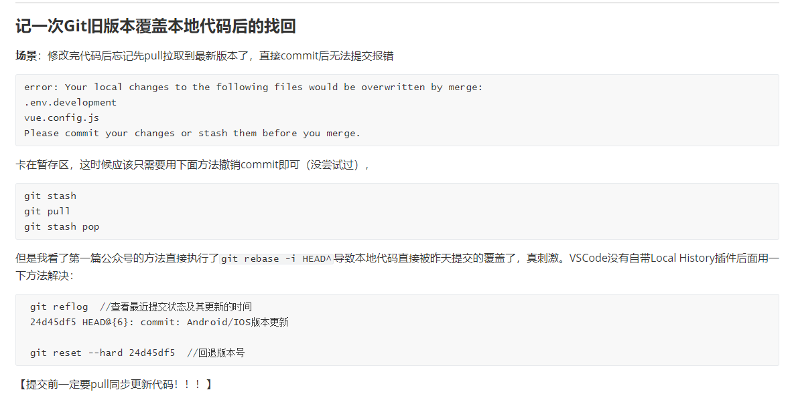

# git提交任务命令流程


```git
git branch 查看当前分支
git  pull 更新至最新分支
git status 查看当前文件修改状况
git add <filepath> 将修改的文件写入暂存区

git commit -m "注释内容"（-m "注释内容"可以替换为回车进行多注释声明） 暂存区提交到本地分支，默认master（重复提交会显示On branch master nothing to commit, working tree clean，因为commit将文件从暂存区提交到对象区了，暂存区没有东西）

git push -u origin master(第一次提交代码文件时使用此命令)

git push （-u origin master） 将分支提交到仓库中，若不是新仓库即使是清空仓库也会失败（因为先前仓库的库版本会有一个commit readme.md而本地没有导致两个版本不一致，可以用pull更新本地再上传或者git push -f origin master强制覆盖。如果为空仓库建议重新建立仓库。）


```


# 没有pull直接提交代码出错解决方案：





