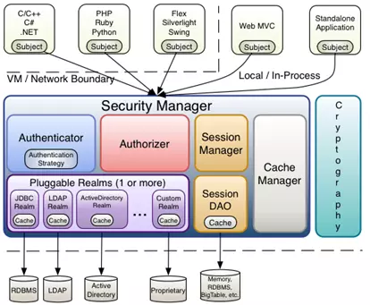

# Shiro笔记

## 1.    Shiro简介

```tip
Shiro是Apache下的一个开源项目。shiro属于轻量级框架，相对于SpringSecurity简单的多，也没有SpringSecurity那么复杂。
```

#### 官方架构图：




## 2.	主要功能

### shiro主要有三大功能模块：

#### 1. Subject：主体，一般指用户。

#### 2. SecurityManager：安全管理器，管理所有Subject，可以配合内部安全组件。(类似于SpringMVC中的DispatcherServlet)

#### 3. Realms：用于进行权限信息的验证，一般需要自己实现。


## 3.	代码

### 1.    pom依赖添加

```pom
<!-- shiro -->
        <dependency>
            <groupId>org.apache.shiro</groupId>
            <artifactId>shiro-spring</artifactId>
            <version>${spring.shiro.version}</version>
        </dependency>

        <dependency>
            <groupId>org.projectlombok</groupId>
            <artifactId>lombok</artifactId>
            <optional>true</optional>
        </dependency>
```

### 2.	编写自己的Realm类

```java
import org.apache.shiro.authc.AuthenticationException;
import org.apache.shiro.authc.AuthenticationInfo;
import org.apache.shiro.authc.AuthenticationToken;
import org.apache.shiro.authc.SimpleAuthenticationInfo;
import org.apache.shiro.authz.AuthorizationInfo;
import org.apache.shiro.authz.SimpleAuthorizationInfo;
import org.apache.shiro.realm.AuthorizingRealm;
import org.apache.shiro.subject.PrincipalCollection;
import org.apache.shiro.util.ByteSource;
import org.springframework.beans.factory.annotation.Autowired;

import com.learnhow.springboot.web.entity.SysPermission;
import com.learnhow.springboot.web.entity.SysRole;
import com.learnhow.springboot.web.entity.User;
import com.learnhow.springboot.web.service.UserService;

public class EnceladusShiroRealm extends AuthorizingRealm {
    @Autowired
    private UserService userService;

    // 授权
    @Override
    protected AuthorizationInfo doGetAuthorizationInfo(PrincipalCollection principals) {
        SimpleAuthorizationInfo authorizationInfo = new SimpleAuthorizationInfo();
        // 获取用户的username
        String username = (String) principals.getPrimaryPrincipal();
        
        User user = userService.findUserByName(username);
        
        for (SysRole role : user.getRoles()) {
            authorizationInfo.addRole(role.getRole());
            for (SysPermission permission : role.getPermissions()) {
                authorizationInfo.addStringPermission(permission.getName());
            }
        }
        return authorizationInfo;
    }

    // 认证
    @Override
    protected AuthenticationInfo doGetAuthenticationInfo(AuthenticationToken token) throws AuthenticationException {
        String username = (String) token.getPrincipal();
        User user = userService.findUserByName(username);

        if (user == null) {
            return null;
        }
        SimpleAuthenticationInfo authenticationInfo = new SimpleAuthenticationInfo(user.getUsername(), user.getPassword(),
                ByteSource.Util.bytes(user.getCredentialsSalt()), getName());
        return authenticationInfo;
    }

}
```

```tip
为了帮助Shiro能够正确为当前登陆用户做认证和赋权，我们需要实现自定义的Realm。具体来说就是实现doGetAuthenticationInfo和doGetAuthorizationInfo，这两个方法前者负责登陆认证后者负责提供一个权限信息。
```


### 3.   	编写自己的ShiroConfig类

```java
package com.my.springbootshiro.config;

import org.apache.shiro.spring.web.ShiroFilterFactoryBean;
import org.apache.shiro.web.mgt.DefaultWebSecurityManager;
import org.springframework.beans.factory.annotation.Qualifier;
import org.springframework.context.annotation.Bean;
import org.springframework.context.annotation.Configuration;

import java.util.LinkedHashMap;

/**
 * @Description:
 * @Author linzt
 * @Date 2020年11月18日 0018
 */
@Configuration
public class ShiroConfig {
    // ShiroFilterFactoryBean
    @Bean
    public ShiroFilterFactoryBean getShiroFilterFactoryBean(@Qualifier("securityManager") DefaultWebSecurityManager defaultWebSecurityManager) {
        ShiroFilterFactoryBean shiroFilterFactoryBean = new ShiroFilterFactoryBean();
        shiroFilterFactoryBean.setSecurityManager(defaultWebSecurityManager);

        /**
         * 几种权限设置：
         * anno: 无需认证就可访问
         * authc： 必须认证了才能访问
         * user： 必须拥有 记住我 功能才能用
         * perms: 拥有对某个资源的权限才能访问
         * role： 拥有某个角色权限才能访问
         */

        // 添加shiro内置过滤器
        LinkedHashMap<String, String> map = new LinkedHashMap<>();
        map.put("/user/add", "perms[user:add]");
        map.put("/user/update", "authc");
//        map.put("/user/*", "authc");
        shiroFilterFactoryBean.setFilterChainDefinitionMap(map);
        shiroFilterFactoryBean.setLoginUrl("/toLogin");
        return shiroFilterFactoryBean;
    }

    // DefaultWebSecurityManager
    @Bean(name="securityManager")
    public DefaultWebSecurityManager getDefaultWebSecurityManager(@Qualifier("userRealm") UserRealm userRealm) {
        DefaultWebSecurityManager defaultWebSecurityManager = new DefaultWebSecurityManager();
        // 关联Realm
        defaultWebSecurityManager.setRealm(userRealm);
        return defaultWebSecurityManager;
    }


    // 创建realm对象
    @Bean
    public UserRealm userRealm() {
        return new UserRealm();
    }
}

```


