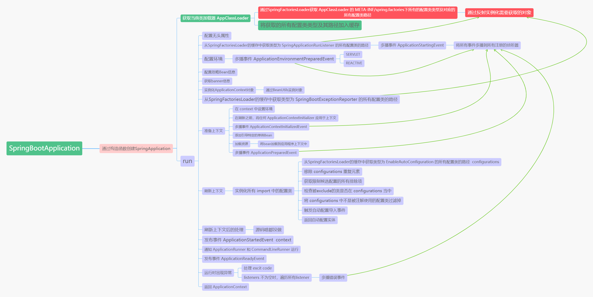

`ApplicationEventMulticaster` 为 所有的 事件多播 接口

想要事件多播需要实现该接口

`publishEvent`  与   `multicastEvent`

`publishEvent` 底层通过  `SimpleApplicationEventMulticaster` 的  `multicastEvent`  进行传播事件，将给定事件发布 给 与给定事件类型匹配的ApplicationListeners的集合侦听器.

