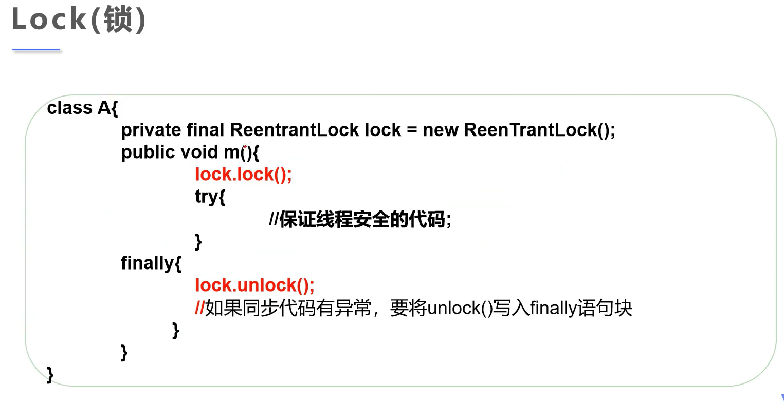

# 多线程

## 一：实现多线程的方式

### 1.通过继承Thread类的方式：

```java
package my.thread;

public class First extends Thread{
    @Override
    public void run() {
        for (int i = 0; i < 1000; i++) {
            System.out.println("i am studying");
        }
    }

    public static void main(String[] args) {
        First first = new First();
        first.start();
        for (int i = 0; i < 1000; i++) {
            System.out.println("i am playing");
        }
    }
}

```

### 2.通过实现Runnable接口方式：

```java
package my.thread;

public class Second implements Runnable{
    @Override
    public void run() {
        for (int i = 0; i < 1000; i++) {
            System.out.println("i am studying");
        }
    }

    public static void main(String[] args) {
        Second second = new Second();
        new Thread(second).start();
        for (int i = 0; i < 1000; i++) {
            System.out.println("i am playing");
        }
    }
}

```

```tip
推荐使用实现Runnable接口方式来使用多线程，避免oop单继承局限性，方便同一个对象被多个线程使用。
```


## 二：多线程操作同一个资源 

当多个线程对一个资源进行获取时，若没有进行资源的保护，则会出现线程不安全的问题

```java
package my.thread;

public class Three implements Runnable{
    private int ticket = 20;
    @Override
    public void run() {
        while(ticket > 0){
            System.out.println(Thread.currentThread().getName() + " get the " +
                    ticket-- + "ticket");
            try {
                Thread.sleep(200);
            } catch (InterruptedException e) {
                e.printStackTrace();
            }
        }
    }

    public static void main(String[] args) {
        Three three = new Three();
        new Thread(three, "wuKong").start();
        new Thread(three, "wuFan").start();
        new Thread(three, "biKe").start();

    }
}

```


### 1.Synchronized

```tip
Synchronized是通过队列+锁实现的
Synchronized可以在方法上添加，也可以使用 synchronized(Obj){}方式在所需的代码块添加。

1.当两个并发线程访问同一个对象object中的这个synchronized(this)同步代码块时，一个时间内只能有一个线程得到执行。另一个线程必须等待当前线程执行完这个代码块以后才能执行该代码块。
2.然而，当一个线程访问object的一个synchronized(this)同步代码块时，另一个线程仍然可以访问该object中的非synchronized(this)同步代码块。
3.尤其关键的是，当一个线程访问object的一个synchronized(this)同步代码块时，其他线程对object中所有其它synchronized(this)同步代码块的访问将被阻塞。
```

### 2.Lock



```tip
也可以通过Lock来锁住需要保证线程安全的代码。
与synchronized的区别:
1.Lock是显示锁(需要手动开启和关闭锁)，synchronized是隐式锁，出了作用于自动释放
2.Lock只能锁代码块
3.使用Lock锁JVM将花费更少的时间来调度线程，性能更好。并且具有更好的扩展性(提供更多的子类)
```


## 三： 进程协作

```tip
不同的进程之间可能存在生产者与消费者的协作关系。
建立中间区，在各自方法调用时，使用wait()使其它线程暂停。（wait()是会释放锁的）
在方法调用结束后使用notifyAll()通知其它线程继续运行。
```


## 四： 线程的sleep、yield、join、priority、daemon

```tip
thread.sleep(1000)
1.sleep一般用于倒计时、模拟网络延时，放大问题的发生性。
2.sleep时间达到后线程进入就绪状态。
3.每一个对象都有一个锁，sleep时不会释放。

thread.yield()
1.线程礼让是指当线程A开始执行时，调用yield使其重新回到就绪状态与其他进程一起竞争。
2.礼让不一定能成功，最终结果由cpu决定。

thred.join()
1.join使正在运行的进程进入阻塞，先执行需要执行的进程。

优先级priority
thread.setPriority(5)
1.优先级priority范围1~10，高优先级的线程并不一定比低优先级的线程要先执行。
2.默认值为5。

守护线程
thread.setDaemon(true)
1.线程分为用户线程和守护线程
2.虚拟机必须确保用户线程执行完毕
3.虚拟机不用等待守护线程执行完毕
4.守护进程比如垃圾回收、监控内存、后台记录操作日志
```


