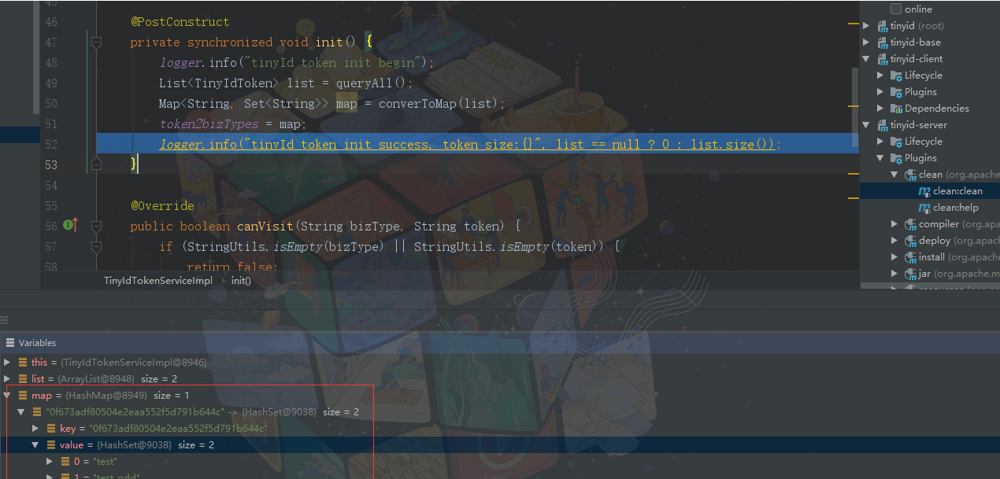
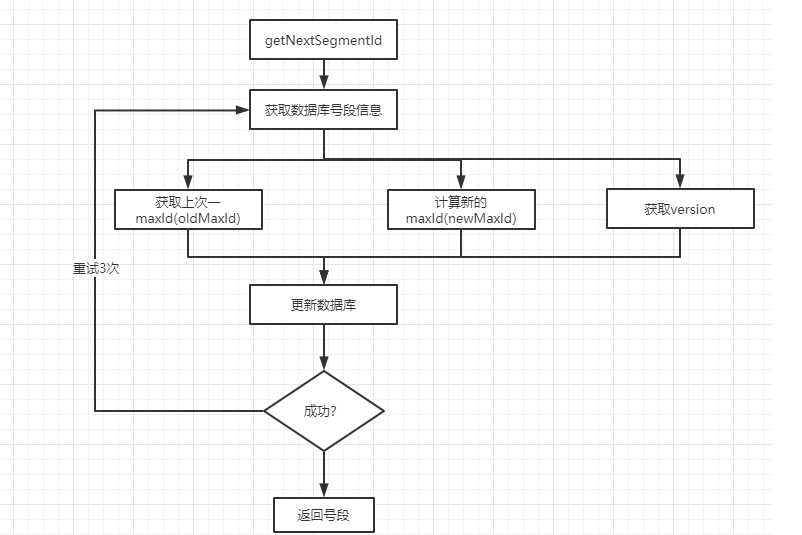
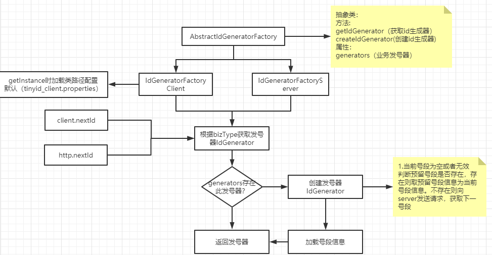
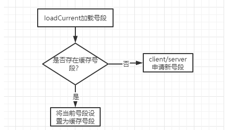
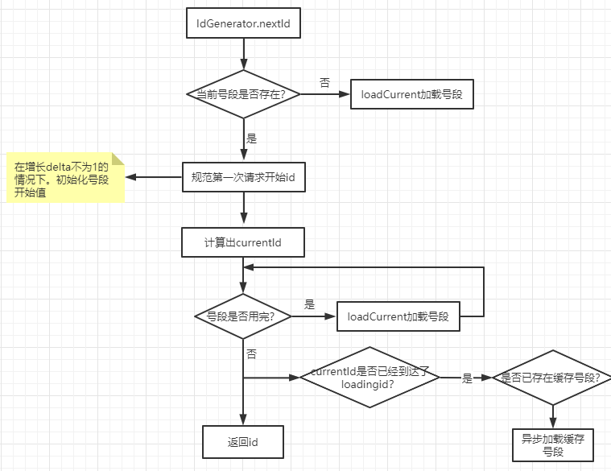

## 号段表设计
存储号段信息,详细文档实现
https://github.com/didi/tinyid/wiki/tinyid%E5%8E%9F%E7%90%86%E4%BB%8B%E7%BB%8D

| 字段      | 长度        | 描述                                                         |
| :-------- | :---------- | :----------------------------------------------------------- |
| id        | bigint(20)  | 自增主键                                                     |
| biz_type  | varchar(63) | 业务类型，唯一                                               |
| begin_id  | bigint(20)  | 开始id，仅记录初始值，无其他含义。初始化时begin_id和max_id应相同 |
| max_id    | bigint(20)  | 当前最大id                                                   |
| step      | int(11)     | 步长                                                         |
| delta     | int(11)     | 每次id增量                                                   |
| remainder | int(11)     | 余数                                                         |
| version   | bigint(20)  | 版本号                                                       |

多db处理：
```
算法：delta=N remainder=0~(n-1)
例：两个db1,db2
对于同一号段：(1,1000]
db1：取 2 4 6 8....1000  delta=2，remainder=0
db2: 取 3 5 7 9 ....999  delta=2，remainder=1

例：三个 db1 db2 db3
db1：取 3 6 9.....  delta=3，remainder=0
db2: 取 4 7 10...  delta=3，remainder=1
db3: 取 5 8 11... delta=3，remainder=2
```


## token维护
#### token意义
token是用来验证调用方身份信息，防止恶意调用
#### token表结构设计 tiny_id_token
| 字段     | 长度         | 描述                        |
| :------- | :----------- | :-------------------------- |
| id       | int(11)      | 自增id                      |
| token    | varchar(255) | token                       |
| biz_type | varchar(63)  | 此token可访问的业务类型标识 |
| remark   | varchar(255) | 备注                        |

#### 初始化表token信息

```
  @PostConstruct
    private synchronized void init() {
        logger.info("tinyId token init begin");
        List<TinyIdToken> list = queryAll();
        Map<String, Set<String>> map = converToMap(list);
        token2bizTypes = map;
        logger.info("tinyId token init success, token size:{}", list == null ? 0 : list.size());
    }
```
初始化项目时会获取token信息以map形式存储 **token2bizTypes**
```
token2bizTypes 结构解析：
key: token
value: [bizType1,bizType2]
从设计结构中可以知道一个token可以被多个业务方使用
```
定时任务维护token信息
```
为了防止token更新，每一分钟会对刷新本地token缓存
@Scheduled(cron = "0 0/1 * * * ?")
    public void refresh() {
        logger.info("refresh token begin");
        init();
}
```
#### token验证逻辑
从本地token2bizTypes中根据调用方传递过来bizType获取本地token信息，与调用方携带token进行比较，存在返回true,不存在返回false
```
public boolean canVisit(String bizType, String token) {
        if (StringUtils.isEmpty(bizType) || StringUtils.isEmpty(token)) {
            return false;
        }
        Set<String> bizTypes = token2bizTypes.get(token);
        return (bizTypes != null && bizTypes.contains(bizType));
}
```
## 接口：nextSegmentId

#### 接口参数
```
params:{
	"bizType": "xxxx",
	"token":"xxxx"
}
```
#### token检验

* 校验方式上面已经给出
```
 if (!tinyIdTokenService.canVisit(bizType, token)) {
            response.setCode(ErrorCode.TOKEN_ERR.getCode());
            response.setMessage(ErrorCode.TOKEN_ERR.getMessage());
            return response;
        }
```
* token错误响应
```
{
    "data": null,
    "code": 5,
    "message": "token is error"
}
```

#### nextSegmentId获取
基本流程


代码逻辑
```
 @Override
    @Transactional(isolation = Isolation.READ_COMMITTED)
    public SegmentId getNextSegmentId(String bizType) {
        // 获取nextTinyId的时候，有可能存在version冲突，需要重试
        for (int i = 0; i < Constants.RETRY; i++) {
            //获取当前数据库号段信息
            TinyIdInfo tinyIdInfo = tinyIdInfoDAO.queryByBizType(bizType);
            if (tinyIdInfo == null) {
                throw new TinyIdSysException("can not find biztype:" + bizType);
            }
            //获取此次数据库 max_id + 步长 获取最新的最大id
            Long newMaxId = tinyIdInfo.getMaxId() + tinyIdInfo.getStep();
            //上一次最大id
            Long oldMaxId = tinyIdInfo.getMaxId();
            //更新数据库。newMaxId（本地计算最大id）,oldMaxId(上次最大id),version(乐观锁version) bizType(业务类型)=
            //update tiny_id_info set max_id= ?,update_time=now(), version=version+1 where id=? and max_id=? and version=? and biz_type=?
            int row = tinyIdInfoDAO.updateMaxId(tinyIdInfo.getId(), newMaxId, oldMaxId, tinyIdInfo.getVersion(), tinyIdInfo.getBizType());
            if (row == 1) {
                //如果更新成功->获取segmentId信息。
                tinyIdInfo.setMaxId(newMaxId);
                SegmentId segmentId = convert(tinyIdInfo);
                logger.info("getNextSegmentId success tinyIdInfo:{} current:{}", tinyIdInfo, segmentId);
                return segmentId;
            } else {
                logger.info("getNextSegmentId conflict tinyIdInfo:{}", tinyIdInfo);
            }
        }
        throw new TinyIdSysException("get next segmentId conflict");
    }
```
从数据库中获取号段信息。从数据库中TinyIdInfo中获取当前号段信息，拿到TinyIdInfo.max_id,
TinyIdInfo.version,TinyIdInfo.step，TinyIdInfo.bizType对数据库进行更新
```
update tiny_id_info set max_id=TinyIdInfo.max_id+step ,update_time=now(), version=version+1 where id=? and max_id={TinyIdInfo.max_id} and version={TinyIdInfo.version} and biz_type={TinyIdInfo.bizType}
```

## 获取IdGenerator发号器
#### 基本流程图


#### IdGenerator封装结构解析
```
protected String bizType;
protected SegmentIdService segmentIdService;
protected volatile SegmentId current;
protected volatile SegmentId next;
private volatile boolean isLoadingNext;
private Object lock = new Object();
private ExecutorService executorService = Executors.newSingleThreadExecutor(new NamedThreadFactory("tinyid-generator"));
public CachedIdGenerator(String bizType, SegmentIdService segmentIdService) {
        this.bizType = bizType;
        this.segmentIdService = segmentIdService;
        loadCurrent();
}
```
* bizType: 业务类型
* segmentIdService（interface）：
 >* DbSegmentIdServiceImpl: 用于server端号段获取
 >* HttpSegmentIdServiceImpl: 提供client端http调用方式

* current（current当前可用的号段信息）
* next（下一个可用的号段信息）
* isLoadingNext（是否已经加载了下一个号段）
* executorService（异步加载的加一个号段提供的线程池）

#### 全局generators

* 数据结构：ConcurrentHashMap
key: bizType
value: IdGenerator(CachedIdGenerator)

* 存储逻辑
对于每个bizType 的id申请，本地都会针对其业务类型创建一个IdGenerator,并在第一次创建biz IdGenerator时获取号段信息
```
  public CachedIdGenerator(String bizType, SegmentIdService segmentIdService) {
        this.bizType = bizType;
        this.segmentIdService = segmentIdService;
        loadCurrent();
  }
```
```
 public synchronized void loadCurrent() {
     if (current == null || !current.useful()) {
         if (next == null) {
            SegmentId segmentId = querySegmentId();
            this.current = segmentId;
         } else {
            current = next;
            next = null;
         }
       }
  }
```

## IdGenerator获取id

#### IdGenerator获取号段逻辑
* 加载biz IdGenerator中 当前号段逻辑

```
/**
     * 加载当前号段
     * 1.如果不存在当前号段 OR 如果当前号段已经消耗完毕了
     * 2.判断是否存在下一个号段信息
     *      不存在----调用http/本地service 请求，获取号段信息
     */
    public synchronized void loadCurrent() {
        if (current == null || !current.useful()) {
            if (next == null) {
                SegmentId segmentId = querySegmentId();
                this.current = segmentId;
            } else {
                current = next;
                next = null;
            }
        }
    }
```
```
public boolean useful() {
        return currentId.get() <= maxId;
    }
```
详解：如果IdGenerator中不存在号段信息或者当前号段已经被消耗完毕，会看是否存在缓存next号段信息，如果存在将缓存next号段信息赋值到本地号段上。

#### IdGenerator从本地号段中取id


* 代码逻辑
```
 @Override
    public Long nextId() {
        while (true) {
            if (current == null) {
                loadCurrent();
                continue;
            }
            Result result = current.nextId();
            if (result.getCode() == ResultCode.OVER) {
                loadCurrent();
            } else {
                if (result.getCode() == ResultCode.LOADING) {
                    loadNext();
                }
                return result.getId();
            }
        }
    }
```
详解：首先，这里做了个while处理，知道从本地号段中获取到id才会返回。
1.如果本地号段为空，走IdGenerator获取号段逻辑（上一步以给出）
2.获取nextId，current.nextId
```
 public Result nextId() {
        //初始化开始的步长 currentId,如果获取的currentId为1001 maxId为2001 step 为3，可以将current初始化到999 nextId->1002
        init();
        long id = currentId.addAndGet(delta);
        if (id > maxId) {
            return new Result(ResultCode.OVER, id);
        }
        if (id >= loadingId) {
            return new Result(ResultCode.LOADING, id);
        }
        return new Result(ResultCode.NORMAL, id);
    }
 /**
     * 这个方法主要为了1,4,7,10...这种序列准备的
     * 设置好初始值之后，会以delta的方式递增，保证无论开始id是多少都能生成正确的序列
     * 如当前是号段是(1000,2000]，delta=3, remainder=0，则经过这个方法后，currentId会先递增到1002,之后每次增加delta
     * 因为currentId会先递增，所以会浪费一个id，所以做了一次减delta的操作，实际currentId会从999开始增，第一个id还是1002
     */
    public void init() {
        if (isInit) {
            return;
        }
        synchronized (this) {
            if (isInit) {
                return;
            }
            long id = currentId.get();
            if (id % delta == remainder) {
                isInit = true;
                return;
            }
            //1001%3=2
            for (int i = 0; i <= delta; i++) {
                //1002
                id = currentId.incrementAndGet();

                if (id % delta == remainder) {
                    // 避免浪费 减掉系统自己占用的一个id
                    // 999
                    currentId.addAndGet(0 - delta);
                    isInit = true;
                    return;
                }
            }
        }
    }
```
**SegmentId.init方法详解**：因为id增量delta可能不是唯一的（多db的情况下，不同的db会配置不同的delta），如果按照正常逻辑，会取号段起始id，在delta内递加。这样的话，就会导致一个问题，我们在获取id之后又做了一个id+delta 操作就会导致一个id缺失。所以做了个currentId.addAndGet(0 - delta)处理
**SegmentId.nextId方法详解**：init方法之后，1.判断是否号段已经耗尽 2.是否已经达到了缓存点loadingId 3.是否正常范围内，如果号段已经耗尽走IdGenerator获取号段逻辑（上面已经给出），然后返回id，如果达到了缓存点loadingId,如果不存在缓存号段则异步申请号段。
```
public class  ResultCode {

    /**
     * 正常可用
     */
    public static final int NORMAL = 1;
    /**
     * 需要去加载nextId
     */
    public static final int LOADING = 2;
    /**
     * 超过maxId 不可用
     */
    public static final int OVER = 3;

    private ResultCode(){

    }
}
```