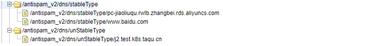

# xy-dns

### 简介

xy-dns 是一个自定义dns解析器，与 Java 默认dns解析器不同，可对不同类型的 dns 解析缓存有不同的检查降级策略，通过定时任务定期检查 dns 服务器

是否正常工作，dns 解析缓存是否发生变化等。


#### 与Java默认解析器功能对比

```tip
1.Java默认dns解析器解析dns时，若域名配置出现问题，导致无法解析，则会在

业务访问该域名时出现 unknownhost 异常，影响业务流程。

自定义解析器  使用了定时任务对dns域名缓存进行检查，可在业务访问之前提前打

出错误日志警告提醒域名配置问题。

2.Java默认dns解析器 无法判定是dns服务器还是单个域名出现问题，当dns服务器

解析出错时，它依旧会对所有需要解析的域名进行解析，虽然有负向缓存，但过期后依

旧会远程解析，这是不必要的。

自定义解析器  在定时任务中，会检测出是单个域名问题还是dns服务器解析问题，当

发现是dns服务器问题时，打印错误日志警告，暂停定时任务一段时间，停止所有远程

解析处理。(降级策略)

3.Java默认dns解析器 所有dns缓存时长都一样，无法根据特定类型dns指定时长，
也无法关闭指定 dns 的缓存。

自定义解析器 可通过设置不同类型dns定时任务间隔时长更新检查缓存。如较为稳定

不易变更的域名可设置相应较长的检查时间间隔。且在线上当你想关闭某 dns 缓存时

可在 ETCD 中对该域名进行配置关闭。
```


###  使用自定义dns解析器步骤

1. 在`application.yml`文件中提供门面类配置
如果选择使用`properties`门面类，则key为`properties`，`value`为properties文件的位置
```yml
dns:
	env: properties
	value: src/main/resources/test1.properties
```
在properties文件中配置如下数据
```properties
stableType = pc-jiaoliuqu.rwlb.zhangbei.rds.aliyuncs.com, api01.aliyun.venuscn.com
unStableType = j2.test.k8s.taqu.cn, j6, live-api.test.k8s.taqu.cn
```

```yml
dns:
  env: properties
  value: src/main/resources/test1.properties
  etcd: antispam_v2/dns/
```

如果选择etcd门面类，则配置为
```yml
dns:
	env: etcd
	etcd: antispam_v2/dns/
```

需配置`/antispam_v2/dns/`的`isOpenFacade`开关是否开启，若关闭则使用的是java默认的dns解析器。

配置每个域名是否开启解析(true or false)



2. 在主类通过静态代码块来设置使用自定义解析器

```java
static {
        //sun.net.spi.nameservice.provider.1
    	// 设置自定义解析器为优先使用
        System.setProperty("sun.net.spi.nameservice.provider.1", "dns,XYDnsNameService");
        System.setProperty("sun.net.spi.nameservice.provider.2", "default");
    }
```