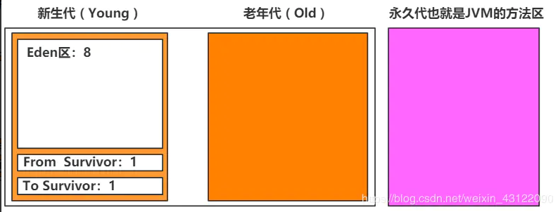

## 垃圾收集器以及新生代、老年代、永久代

### 讲一下新生代、老年代、永久代的区别

- 在 Java 中，堆被划分成两个不同的区域：新生代 ( Young )、老年代 ( Old )。而新生代 ( Young ) 又被划分为三个区域：Eden、From Survivor、To Survivor。这样划分的目的是为了使 JVM 能够更好的管理堆内存中的对象，包括内存的分配以及回收。
- 新生代中一般保存新出现的对象，所以每次垃圾收集时都发现大批对象死去，只有少量对象存活，便采用了`复制算法`，只需要付出少量存活对象的复制成本就可以完成收集。
- 新生代又分为Eden和Survivor （From与To，这里简称一个区）两个区。加上老年代就这三个区。数据会首先分配到Eden区当中（当然也有特殊情况，如果是大对象那么会直接放入到老年代（大对象是指需要大量连续内存空间的java对象）。当Eden没有足够空间的时候就会触发jvm发起一次Minor GC，。如果对象经过一次Minor-GC还存活，并且又能被Survivor空间接受，那么将被移动到Survivor空间当中。并将其年龄设为1，对象在Survivor每熬过一次Minor GC，年龄就加1，当年龄达到一定的程度（默认为15）时，就会被晋升到老年代中了，当然晋升老年代的年龄是可以设置的。
- 老年代中一般保存存活了很久的对象，他们存活率高、没有额外空间对它进行分配担保，就必须采用`“标记-清理”或者“标记-整理”`算法。
- 永久代就是JVM的方法区。在这里都是放着一些被虚拟机加载的类信息，静态变量，常量等数据。这个区中的东西比老年代和新生代更不容易回收。

### 怎么判断对象是否可以被回收？

- 垃圾收集器在做垃圾回收的时候，首先需要判定的就是哪些内存是需要被回收的，哪些对象是存活的，是不可以被回收的；哪些对象已经死掉了，需要被回收。
- 一般有两种方法来判断：
  - 引用计数器法：为每个对象创建一个引用计数，有对象引用时计数器 +1，引用被释放时计数 -1，当计数器为 0 时就可以被回收。它有一个缺点不能解决循环引用的问题；（这个已经淘汰了）
  - 可达性分析算法：从 GC Roots 开始向下搜索，搜索所走过的路径称为引用链。当一个对象到 GC Roots 没有任何引用链相连时，则证明此对象是可以被回收的。（市场上用的非常非常广泛）

### Minor GC、Major GC、Full GC是什么

1. Minor GC是新生代GC，指的是发生在新生代的垃圾收集动作。由于java对象大都是朝生夕死的，所以Minor GC非常频繁，一般回收速度也比较快。（一般采用复制算法回收垃圾）
2. Major GC是老年代GC，指的是发生在老年代的GC，通常执行Major GC会连着Minor GC一起执行。Major GC的速度要比Minor GC慢的多。（可采用标记清楚法和标记整理法）
3. Full GC是清理整个堆空间，包括年轻代和老年代

### 为什么新生代要分Eden和两个 Survivor 区域？

- 如果没有Survivor，Eden区每进行一次Minor GC，存活的对象就会被送到老年代。老年代很快被填满，触发Major GC.老年代的内存空间远大于新生代，进行一次Full GC消耗的时间比Minor GC长得多,所以需要分为Eden和Survivor。
- Survivor的存在意义，就是减少被送到老年代的对象，进而减少Full GC的发生，Survivor的预筛选保证，只有经历15次Minor GC还能在新生代中存活的对象，才会被送到老年代。
- 设置两个Survivor区最大的好处就是解决了碎片化，刚刚新建的对象在Eden中，经历一次Minor GC，Eden中的存活对象就会被移动到第一块survivor space S0，Eden被清空；等Eden区再满了，就再触发一次Minor GC，Eden和S0中的存活对象又会被复制送入第二块survivor space S1（这个过程非常重要，因为这种复制算法保证了S1中来自S0和Eden两部分的存活对象占用连续的内存空间，避免了碎片化的发生）
  - 把 Eden + From Survivor 存活的对象放入 To Survivor 区；
  - 清空 Eden 和 From Survivor 分区；
  - From Survivor 和 To Survivor 分区交换，From Survivor 变 To Survivor，To Survivor 变 From Survivor。

### Java堆老年代( Old ) 和新生代 ( Young ) 的默认比例？

- 默认的，新生代 ( Young ) 与老年代 ( Old ) 的比例的值为 1:2 ( 该值可以通过参数 –XX:NewRatio 来指定 )，即：新生代 ( Young ) = 1/3 的堆空间大小。老年代 ( Old ) = 2/3 的堆空间大小。
- 其中，新生代 ( Young ) 被细分为 Eden 和 **两个 Survivor 区域**，Edem 和俩个Survivor 区域比例是 = 8 : 1 : 1 ( 可以通过参数 –XX:SurvivorRatio 来设定 )，
- 但是JVM 每次只会使用 Eden 和其中的一块 Survivor 区域来为对象服务，所以无论什么时候，总是有一块 Survivor 区域是空闲着的。

#### 为什么大对象直接进入老年代

- 所谓大对象是指需要大量连续内存空间的对象，频繁出现大对象是致命的，会导致在内存还有不少空间的情况下提前触发 GC 以获取足够的连续空间来安置新对象。
- 前面我们介绍过新生代使用的是标记-清除算法来处理垃圾回收的，如果大对象直接在新生代分配就会导致 Eden 区和两个 Survivor 区之间发生大量的内存复制。因此对于大对象都会直接在老年代进行分配。

