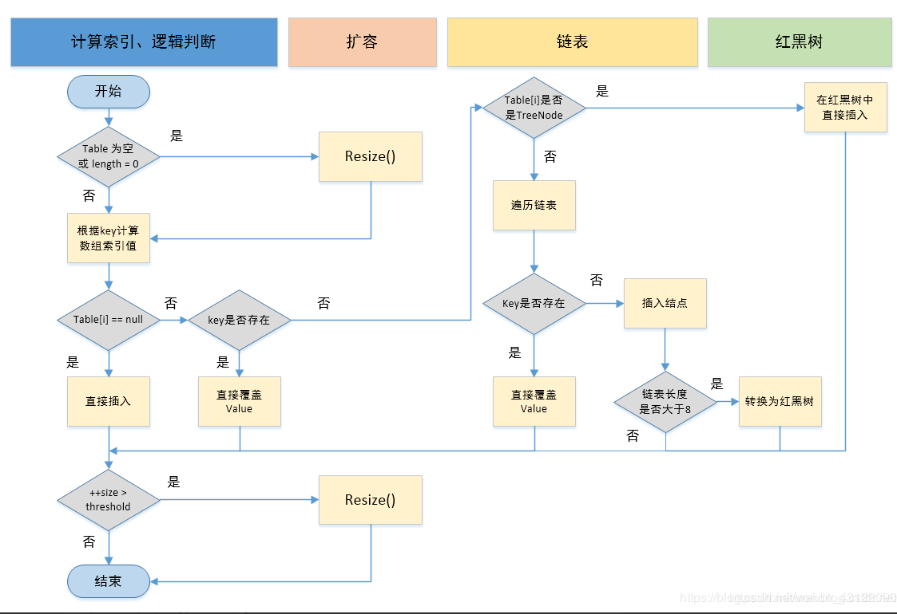

### HashMap的put方法的具体流程？

- 当我们put的时候，首先计算 `key`的`hash`值，这里调用了 `hash`方法，`hash`方法实际是让`key.hashCode()`与`key.hashCode()>>>16`进行异或操作，高16bit补0，一个数和0异或不变，所以 hash 函数大概的作用就是：**高16bit不变，低16bit和高16bit做了一个异或，目的是减少碰撞**。按照函数注释，因为bucket数组大小是2的幂，计算下标`index = (table.length - 1) & hash`，如果不做 hash 处理，相当于散列生效的只有几个低 bit 位，为了减少散列的碰撞，设计者综合考虑了速度、作用、质量之后，使用高16bit和低16bit异或来简单处理减少碰撞，而且JDK8中用了复杂度 O（logn）的树结构来提升碰撞下的性能。

  **所以重写equal后，为了保证一致性，也要将hashcode重写。如重写equal判断条件为name相等，则hashcode重写为通过name属性生成hashcode，保证map上的 key 唯一性。**

- putVal方法执行流程图




### HashMap的扩容操作是怎么实现的？

1. 在jdk1.8中，resize方法是在hashmap中的键值对大于阀值时或者初始化时，就调用resize方法进行扩容；
2. 每次扩展的时候，都是扩展2倍；
3. 扩展后Node对象的位置要么在原位置，要么移动到原偏移量两倍的位置。

- 在putVal()中，我们看到在这个函数里面使用到了2次resize()方法，resize()方法表示的在进行第一次初始化时会对其进行扩容，或者当该数组的实际大小大于其临界值值(第一次为12),这个时候在扩容的同时也会伴随的桶上面的元素进行重新分发，这也是JDK1.8版本的一个优化的地方，在1.7中，扩容之后需要重新去计算其Hash值，根据Hash值对其进行分发，但在1.8版本中，则是根据在同一个桶的位置中进行判断(e.hash & oldCap)是否为0，重新进行hash分配后，该元素的位置要么停留在原始位置，要么移动到原始位置+增加的数组大小这个位置上


### 能否使用任何类作为 Map 的 key？

可以使用任何类作为 Map 的 key，然而在使用之前，需要考虑以下几点：

- 如果类重写了 equals() 方法，也应该重写 hashCode() 方法。
- 类的所有实例需要遵循与 equals() 和 hashCode() 相关的规则。
- 如果一个类没有使用 equals()，不应该在 hashCode() 中使用它。
- 用户自定义 Key 类最佳实践是使之为不可变的，这样 hashCode() 值可以被缓存起来，拥有更好的性能。不可变的类也可以确保 hashCode() 和 equals() 在未来不会改变，这样就会解决与可变相关的问题了。


### 如果使用Object作为HashMap的Key，应该怎么办呢？

- 答：重写

  ```
  hashCode()
  ```

  和

  ```
  equals()
  ```

  方法

  1. **重写`hashCode()`是因为需要计算存储数据的存储位置**，需要注意不要试图从散列码计算中排除掉一个对象的关键部分来提高性能，这样虽然能更快但可能会导致更多的Hash碰撞；
  2. **重写`equals()`方法**，需要遵守自反性、对称性、传递性、一致性以及对于任何非null的引用值x，x.equals(null)必须返回false的这几个特性，**目的是为了保证key在哈希表中的唯一性**；

