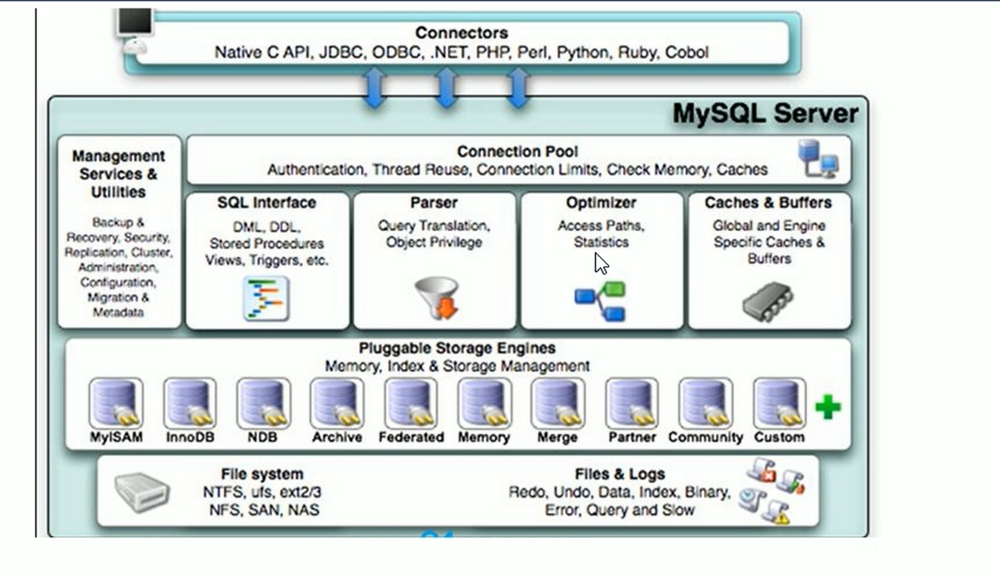
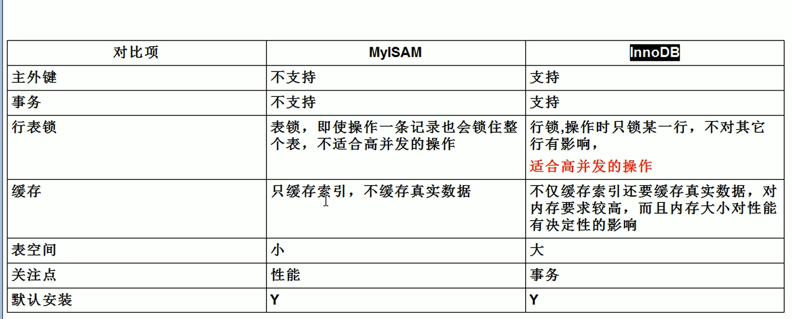

## 一 Mysql的逻辑架构



### 1.连接层

```tip
第一层是一些客户端和连接服务，包含本地sock通信和大多数基于客服端、服务端工具实现的类似于tcp/ip的通信。主要完成一些类似于连接处理、
授权认证、相关的安全方案。在改成引入了线程池概念，为通过认证安全接入的客户端提供线程。同样在该层上可以实现基于SSL的安全连接。
服务器也会为安全接入的每个客户端验证其操作权限
```

### 2.服务层

```tip
第二层架构主要完成大多核心服务功能，如SQL接口，并完成缓存的查询，SQL的分析和优化及部分内置函数的执行。所有跨存储引擎的功能也在这一层实现。
如过程、函数等。服务器会解析并创建相应的内部解析树，并对其完成相应的优化如确定查询表的顺序，是否利用索引等，最后生成相应的执行操作。如果是
Select语句，服务器还会查询内部缓存。如果缓存空间足够大，在解决大量读操作的环境中	能够很好的提升系统的性能。
```

### 3.引擎层

```tip
存储引擎层，存储引擎真正负责了Mysql中数据的存储和提取，服务器通过API与存储引擎进行通信。不同的存储引擎具有的功能不同，这样我们可以根据自己
的实际需求进行选取。
```

### 4.存储层

```tip
数据存储层主要将数据存储在运行于裸机的文件系统上，并完成与存储引擎的交互。
```


## 二 存储引擎



```tip
1、MyISAM：默认表类型，它是基于传统的ISAM类型，ISAM是Indexed Sequential Access Method (有索引的顺序访问方法) 的缩写，它是存储记录和文件的标准方法。不是事务安全的，而且不支持外键，如果执行大量的select，insert MyISAM比较适合。

2、InnoDB：支持事务安全的引擎，支持外键、行锁、事务是他的最大特点。如果有大量的update和insert，建议使用InnoDB，特别是针对多个并发和QPS较高的情况。
```

## 三  索引


```tip
索引是一种帮助Mysql快速获取数据的数据结构
可以理解为 排好序的快速查找数据结构
索引会对where后面的条件判断和orderby排序有影响
```


### 适合建立索引的情况

```tip
1.主键自动建立唯一索引
2.频繁作为查询条件的字段
3.与其它表关联的字段，外键关系建立索引
4.单键/组合 索引的选择问题。 高并发下倾向创建组合索引
5.查询中 统计或者分组的字段
```

### 不适合建立索引的情况

```tip
1.表记录太少
2.经常增删改的字段
3.数据重复且平均分配的字段。 如果某个数据列包含许多重复内容，为它建立索引就没什么太大效果
```

