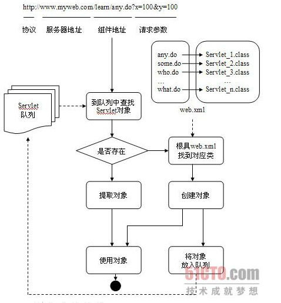
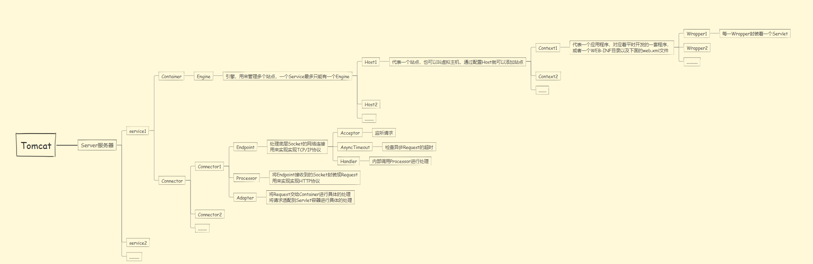
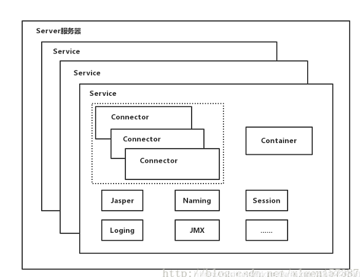
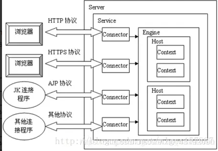
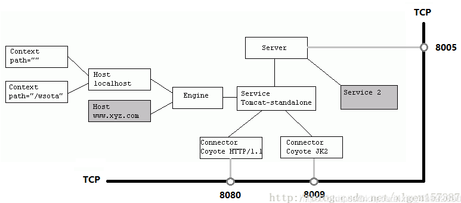
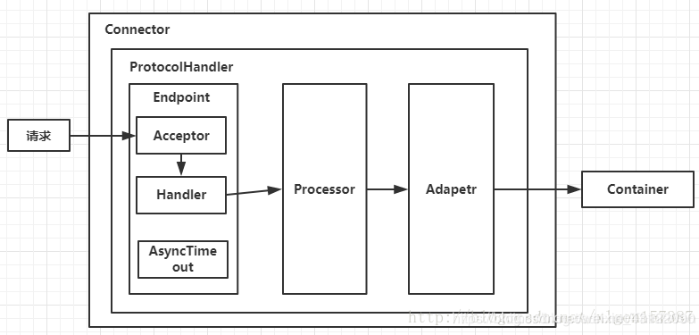
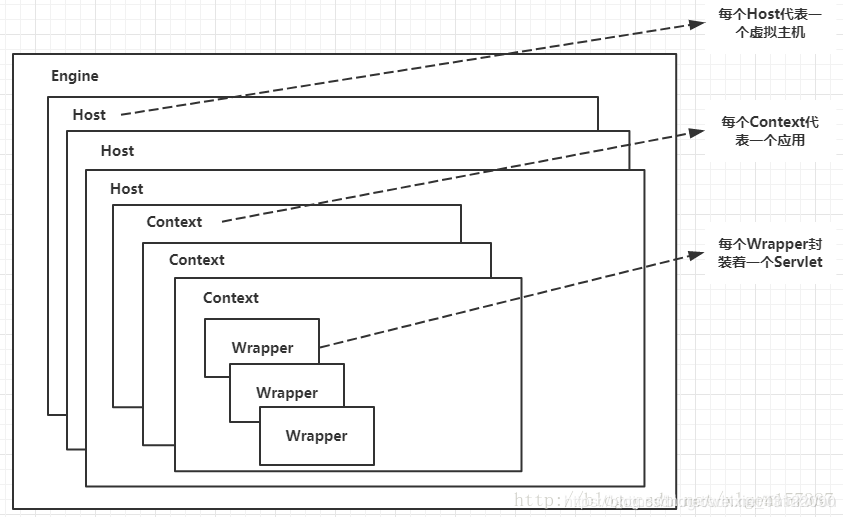
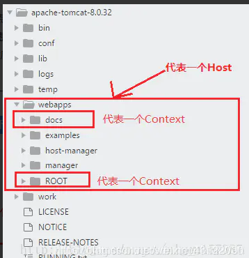
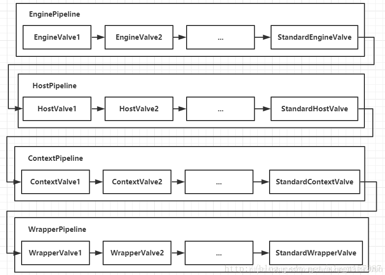

## servlet

[Java](http://lib.csdn.net/base/java)是一种动态加载和运行的语言。也就是说当应用程序持有一个类的地址（CLASSPATH）和名称（包名和类名）的情况下，可以在程序运行期 间任何时候加载这个类，并创建和使用该类的对象。Servlet就是基于这个机制与Web容器融合在一起的。目前已知的所有支持[Java ](http://lib.csdn.net/base/java)Servlet的Web容器都是采用Java开发的。当Web容器接收到来自客户端的请求信息之后，会根据URL中的Web元件地址信息到Servlet 队列中查找对应的Servlet对象，如果找到则直接使用，如果没有找到则加载对应的类，并创建对象。也就是说，Servlet对象是在第一次被使用的时 候才创建的，并且一旦创建就会被反复使用，不再创建新的对象。所有创建出的Servlet对象会在Web服务器停止运行的时候统一进行垃圾回收。

为 了解决客户端请求地址与[java ](http://lib.csdn.net/base/java)Servlet之间对应关系问题，Web容器需要一个用来描述这种对应关系的文件，一般是web.xml文件。如果一个Web应用程序中存在很多个 Servlet，那么web.xml会变得非常庞大。在Servlet 3.0规范推出之后，允许在Servlet代码中使用声明式语法来代替web.xml中的描述信息，这才让web.xml瘦身下来。下图是这个过程的一个 示意图。

在这个图中，我们仅仅是概要的，采用以比较容 易理解的方式描述了Web容器与Servlet之间的关系，以及当接受到请求之后的处理流程。在实际的Web容器中，会比这要复杂很多。

## Tomcat顶层架构

- 俗话说，站在巨人的肩膀上看世界，一般学习的时候也是先总览一下整体，然后逐个部分个个击破，最后形成思路，了解具体细节，Tomcat的结构很复杂，但是 Tomcat 非常的模块化，找到了 Tomcat 最核心的模块，问题才可以游刃而解，了解了 Tomcat 的整体架构对以后深入了解 Tomcat 来说至关重要！
- 先上一张Tomcat的顶层结构图（图A），如下：

- Tomcat中最顶层的容器是Server，代表着整个服务器，从上图中可以看出，一个Server可以包含至少一个Service，即可以包含多个Service，用于具体提供服务。
- Service主要包含两个部分：Connector和Container。从上图中可以看出 Tomcat 的心脏就是这两个组件，他们的作用如下：
  - Connector用于处理连接相关的事情，并提供Socket与Request请求和Response响应相关的转化;
  - Container用于封装和管理Servlet，以及具体处理Request请求；
- 一个Tomcat中只有一个Server，一个Server可以包含多个Service，一个Service只有一个Container，但是可以有多个Connectors，这是因为一个服务可以有多个连接，如同时提供Http和Https链接，也可以提供向相同协议不同端口的连接，示意图如下（Engine、Host、Context下面会说到）：

Server标签设置的端口号为8005，shutdown=”SHUTDOWN” ，表示在8005端口监听“SHUTDOWN”命令，如果接收到了就会关闭Tomcat。一个Server有一个Service，当然还可以进行配置，一个Service有多个Connector，Service左边的内容都属于Container的，Service下边是Connector。

## Connector

我们可以把Connector分为四个方面进行理解：

- Connector如何接受请求的？
- 如何将请求封装成Request和Response的？
- 封装完之后的Request和Response如何交给Container进行处理的？
- Container处理完之后如何交给Connector并返回给客户端的？

首先看一下Connector的结构图（图B），如下所示：

Connector就是使用ProtocolHandler来处理请求的，不同的ProtocolHandler代表不同的连接类型，比如：Http11Protocol使用的是普通Socket来连接的，Http11NioProtocol使用的是NioSocket来连接的。

其中ProtocolHandler由包含了三个部件：Endpoint、Processor、Adapter。

1. Endpoint用来处理底层Socket的网络连接，Processor用于将Endpoint接收到的Socket封装成Request，Adapter用于将Request交给Container进行具体的处理。
2. Endpoint由于是处理底层的Socket网络连接，因此Endpoint是用来实现TCP/IP协议的，而Processor用来实现HTTP协议的，Adapter将请求适配到Servlet容器进行具体的处理。
3. Endpoint的抽象实现AbstractEndpoint里面定义的Acceptor和AsyncTimeout两个内部类和一个Handler接口。Acceptor用于监听请求，AsyncTimeout用于检查异步Request的超时，Handler用于处理接收到的Socket，在内部调用Processor进行处理。

至此，我们应该很轻松的回答1，2，3的问题了，但是4还是不知道，那么我们就来看一下Container是如何进行处理的以及处理完之后是如何将处理完的结果返回给Connector的？

## Container架构分析

- Container用于封装和管理Servlet，以及具体处理Request请求，在Container内部包含了4个子容器，结构图如下（图C）：

- 4个子容器的作用分别是：

  1. Engine：引擎，用来管理多个站点，一个Service最多只能有一个Engine；
  2. Host：代表一个站点，也可以叫虚拟主机，通过配置Host就可以添加站点；
  3. Context：代表一个应用程序，对应着平时开发的一套程序，或者一个WEB-INF目录以及下面的web.xml文件；
  4. Wrapper：每一Wrapper封装着一个Servlet；

- 下面找一个Tomcat的文件目录对照一下，如下图所示：

  

  

  

### Container如何处理请求的

- Container处理请求是使用Pipeline-Valve管道来处理的！（Valve是阀门之意）
- Pipeline-Valve是**责任链模式**，责任链模式是指在一个请求处理的过程中有很多处理者依次对请求进行处理，每个处理者负责做自己相应的处理，处理完之后将处理后的结果返回，再让下一个处理者继续处理。

- 但是！Pipeline-Valve使用的责任链模式和普通的责任链模式有些不同！区别主要有以下两点：
  - 每个Pipeline都有特定的Valve，而且是在管道的最后一个执行，这个Valve叫做BaseValve，BaseValve是不可删除的；
  - 在上层容器的管道的BaseValve中会调用下层容器的管道。
- 我们知道Container包含四个子容器，而这四个子容器对应的BaseValve分别在：StandardEngineValve、StandardHostValve、StandardContextValve、StandardWrapperValve。
- Pipeline的处理流程图如下（图D）：

- Connector在接收到请求后会首先调用最顶层容器的Pipeline来处理，这里的最顶层容器的Pipeline就是EnginePipeline（Engine的管道）；
- 在Engine的管道中依次会执行EngineValve1、EngineValve2等等，最后会执行StandardEngineValve，在StandardEngineValve中会调用Host管道，然后再依次执行Host的HostValve1、HostValve2等，最后在执行StandardHostValve，然后再依次调用Context的管道和Wrapper的管道，最后执行到StandardWrapperValve。
- 当执行到StandardWrapperValve的时候，会在StandardWrapperValve中创建FilterChain，并调用其doFilter方法来处理请求，这个FilterChain包含着我们配置的与请求相匹配的Filter和Servlet，其doFilter方法会依次调用所有的Filter的doFilter方法和Servlet的service方法，这样请求就得到了处理！
- 当所有的Pipeline-Valve都执行完之后，并且处理完了具体的请求，这个时候就可以将返回的结果交给Connector了，Connector在通过Socket的方式将结果返回给客户端。

