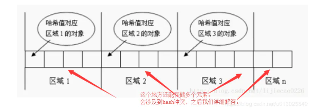
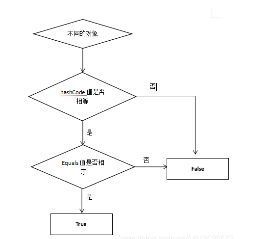

如果你想查找一个集合中是否包含某个对象，那么程序应该怎么写呢？不要用indexOf方法的话，就是从集合中去遍历然后比较是否想到。万一集合中有10000个元素呢，累屎了是吧。所以为了提高效率，哈希算法也就产生了。核心思想就是将集合分成若干个存储区域（可以看成一个个桶），每个对象可以计算出一个哈希码，可以根据哈希码分组，每组分别对应某个存储区域，这样一个对象根据它的哈希码就可以分到不同的存储区域（不同的区域）。





在集合```HashMap```中插入元素的时候，实际上是先比较hashcode，如果相等了之后才去比较equal方法。



```
由于为了提高程序的效率才实现了hashcode方法，先进行hashcode的比较，如果不同，
那没就不必在进行equals的比较了，这样就大大减少了equals比较的次数，这对比需要比较的数量很大的效率提高是很明显的，
为什么必须要重写hashcode方法，
其实简单的说就是为了保证同一个对象，保证在equals相同的情况下hashcode值必定相同，
如果重写了equals而未重写hashcode方法，可能就会出现两个没有关系的对象equals相同的
（因为equal都是根据对象的特征进行重写的），但hashcode确实不相同的
```

```
如果我们对一个对象重写了euqals，意思是只要对象的成员变量值都相等那么euqals就等于true，
但不重写hashcode，那么我们再new一个新的对象，当原对象.equals（新对象）等于true时，两者的hashcode却是不一样的
，由此将产生了理解的不一致，如在存储散列集合时（如Set类），将会存储了两个值一样的对象，导致混淆，
因此，就也需要重写hashcode()
```