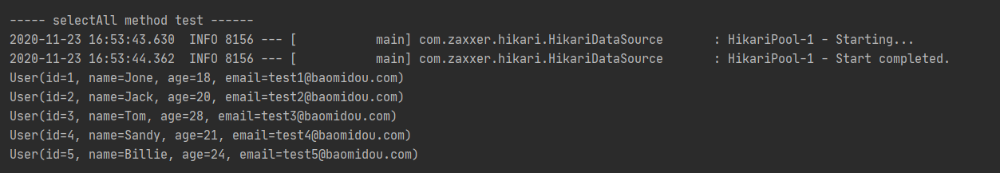
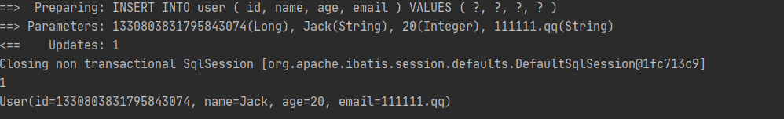
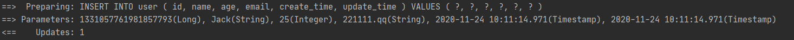
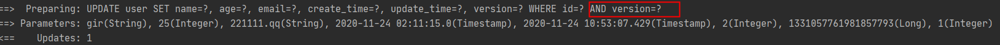
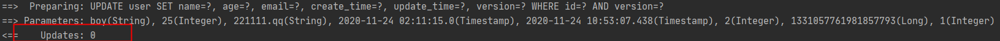
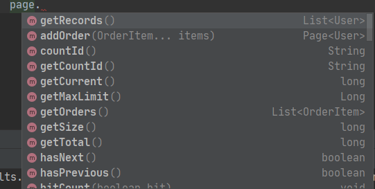
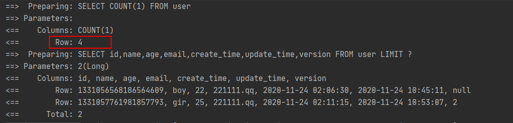
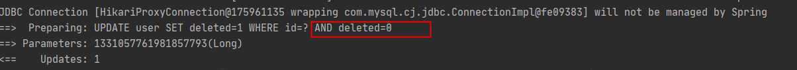

# Mybatis_plus

### 一. Mybatis-plus基本项目结构

#### 1.导入依赖

```xml
<parent>
        <groupId>org.springframework.boot</groupId>
        <artifactId>spring-boot-starter-parent</artifactId>
        <version>2.4.0</version>
        <relativePath/> <!-- lookup parent from repository -->
</parent>
<dependencies>
        <dependency>
            <groupId>org.springframework.boot</groupId>
            <artifactId>spring-boot-starter-web</artifactId>
        </dependency>

        <dependency>
            <groupId>org.springframework.boot</groupId>
            <artifactId>spring-boot-starter</artifactId>
        </dependency>

        <dependency>
            <groupId>org.projectlombok</groupId>
            <artifactId>lombok</artifactId>
            <optional>true</optional>
        </dependency>
        <dependency>
            <groupId>com.baomidou</groupId>
            <artifactId>mybatis-plus-boot-starter</artifactId>
            <version>3.4.1</version>
        </dependency>
        <dependency>
            <groupId>mysql</groupId>
            <artifactId>mysql-connector-java</artifactId>
        </dependency>

        <dependency>
            <groupId>org.springframework.boot</groupId>
            <artifactId>spring-boot-starter-test</artifactId>
            <scope>test</scope>
        </dependency>
        <dependency>
            <groupId>junit</groupId>
            <artifactId>junit</artifactId>
            <scope>test</scope>
        </dependency>
</dependencies>
```


#### 2.配置yml文件

```yml
spring:
  datasource:
    driver: com.mysql.cj.jdbc.Driver
    username: root
    password: 123456
    url: jdbc:mysql://localhost:3306/mybatis_plus?useSSL=true&useUnicode=true&characterEncoding=UTF-8&serverTimezone=UTC
 
mybatis-plus:
  configuration:
    log-impl: org.apache.ibatis.logging.stdout.StdOutImpl
```


#### 3.生成pojo类

```java
@Data
public class User {
    private Long id;
    private String name;
    private Integer age;
    private String email;
}
```


#### 4.生成mapper接口类继承BaseMapper

```java
@Repository
public interface UserMapper extends BaseMapper<User> {
}
```


#### 5.在主程序添加mapperscan注解

```java
@SpringBootApplication
@MapperScan("com.my.mybatis_plus.mapper")
public class MybatisPlusApplication {

    public static void main(String[] args) {
        SpringApplication.run(MybatisPlusApplication.class, args);
    }

}
```


#### 6.在测试类测试结果

```java
@RunWith(SpringRunner.class)
@SpringBootTest
class MybatisPlusApplicationTests {
    @Autowired
    private UserMapper userMapper;

    @Test
    void contextLoads() {
        System.out.println(("----- selectAll method test ------"));
        List<User> userList = userMapper.selectList(null);
        userList.forEach(System.out::println);
    }

}
```




### 二： 插入数据的主键生成策略

```java
@Test
    public void testInsert() {
        User user = new User();
        user.setAge(20);
        user.setEmail("111111.qq");
        user.setName("Jack");

        int result = userMapper.insert(user);
        System.out.println(result);
        System.out.println(user);
    }
```



```java
public enum IdType {
    AUTO(0),	// 数据库id自增
    NONE(1),	// 未设置主键
    INPUT(2),	//手动输入
    ASSIGN_ID(3), 
    ASSIGN_UUID(4),
    /** @deprecated */
    @Deprecated
    ID_WORKER(3),	//默认全局唯一id
    /** @deprecated */
    @Deprecated
    ID_WORKER_STR(3),  //ID_WORKER 字符串表示法
    /** @deprecated */
    @Deprecated
    UUID(4);		//默认全局唯一id uuid
}
```


```tip
在插入数据时，若没有传入id值，BaseMapper便会采用雪花算法生成一个唯一的id值。
默认值为  @TableId(type = IdType.ID_WORKER_STR)   

SnowFlake 算法，是 Twitter 开源的分布式 id 生成算法。其核心思想就是：使用一个 64 bit 的 long 型的数字作为全局唯一 id。在分布式系统中的应用十分广泛，且ID 引入了时间戳，基本上保持自增。
```


### 三： 插入数据

```java
@Test
    public void testUpdate() {
        User user = new User();
        user.setId(1L);
        user.setAge(1);
        user.setEmail("111111.qq");
        int res = userMapper.updateById(user);
        System.out.println(res);
    }
```


```tip
所有的sql都可以动态装配，只需向user对象填充你需要修改的数据即可。
```


### 四： 自动填充处理

```tip
每个数据库都应该要有updatetime和createtime两个字段，且这两个字段都应该自动修改
```

#### 1. 数据库级别

```tip
在数据库中添加两个字段
`create_time` DATETIME NOT NULL DEFAULT CURRENT_TIMESTAMP COMMENT '创建时间',
`update_time` DATETIME NOT NULL DEFAULT CURRENT_TIMESTAMP ON UPDATE CURRENT_TIMESTAMP COMMENT '更新时间'
在插入数据时或者修改数据时，两个字段便会自动修改对应的值。
```

#### 2.代码级别

##### 在相应字段上添加注解

```java
@TableField(fill = FieldFill.INSERT)
    private Date createTime;
    @TableField(fill = FieldFill.INSERT_UPDATE)
    private Date updateTime;
```

##### 编写处理器来处理注解

```java
package com.my.mybatis_plus.handle;

import com.baomidou.mybatisplus.core.handlers.MetaObjectHandler;
import org.apache.ibatis.reflection.MetaObject;
import org.springframework.stereotype.Component;

import java.util.Date;

/**
 * @Description:
 * @Author linzt
 * @Date 2020年11月24日 0024
 */
@Component
public class MyMetaObjectHandler implements MetaObjectHandler {
    @Override
    public void insertFill(MetaObject metaObject) {
        this.setFieldValByName("createTime", new Date(), metaObject);
        this.setFieldValByName("updateTime", new Date(), metaObject);
    }

    @Override
    public void updateFill(MetaObject metaObject) {
        this.setFieldValByName("updateTime", new Date(), metaObject);
    }
}

```



```tip
这种方法需要yml文件中的url serverTimezone 时区配置，否则会发现数据库的时间与插入的时间不一致的问题
url: jdbc:mysql://localhost:3306/mybatis_plus?useSSL=true&useUnicode=true&characterEncoding=UTF-8&serverTimezone=GMT%2b8
```


### 五：乐观锁

##### 1.添加相应注解

```java
@Version
    private Integer version;
```

##### 2.注册组件

```java
@Bean
    public MybatisPlusInterceptor mybatisPlusInterceptor() {
        MybatisPlusInterceptor interceptor = new MybatisPlusInterceptor();
        // 注册乐观锁插件
        interceptor.addInnerInterceptor(new OptimisticLockerInnerInterceptor());
        return interceptor;
    }
```


##### 3.测试

```java
 @Test
    public void testLock() {
        User user1 = userMapper.selectById(1331057761981857793L);
        user1.setName("boy");

        User user2 = userMapper.selectById(1331057761981857793L);
        user2.setName("gir");
        userMapper.updateById(user2);

        userMapper.updateById(user1);
    }
```





```tip
有运行结果可以看出：
两个user获得了同一个乐观锁version
第一次修改的是user2，且在修改时不止根据id进行条件判断，还会根据version乐观锁的值进行判断能否修改。
当user1想修改时，由于user2已经修改并且version值已经改变，所有user1将修改失败
```


### 六：分页查询

#### 1.注册组件

```java
// 分页插件
    @Bean
    public MybatisPlusInterceptor mybatisPlusInterceptor() {
        MybatisPlusInterceptor interceptor = new MybatisPlusInterceptor();
        // 分页插件
        interceptor.addInnerInterceptor(new PaginationInnerInterceptor(DbType.MYSQL));
        // 注册乐观锁插件
        interceptor.addInnerInterceptor(new OptimisticLockerInnerInterceptor());
        return interceptor;
    }
```

#### 2.测试

```java
@Test
    public void testPage() {
        Page<User> page = new Page<>(1, 2);
        userMapper.selectPage(page, null);
        page.getRecords().forEach(System.out::println);
    }
```





```tip
分页插件实现原理为 通过先查询所有数据然后再进行分页查询
所以page可以获取到表的很多信息。
```

#### sql性能规范插件

```java
// sql性能规范插件
        interceptor.addInnerInterceptor(new IllegalSQLInnerInterceptor());
```

```tip
存在bug   尚不知道如何使用
```


### 七：查询操作

#### 1.条件查询

```java
@Test
    public void testConditionFind() {
        HashMap<String, Object> map = new HashMap<>();
        map.put("name", "James");
        map.put("id", 1331058613324967937L);

        List<User> users = userMapper.selectByMap(map);
        users.forEach(System.out::println);
    }
```

#### 2.查询多项结果

```java
@Test
    public void testBatch() {
        List<User> users = userMapper.selectBatchIds(Arrays.asList(1331058613324967937L, 1331063541007233025L));
        users.forEach(System.out::println);
    }
```


### 八：删除操作

#### 普通删除

```java
@Test
public void testDelete() {
    userMapper.deleteById(1331056568186564609L);

    userMapper.deleteBatchIds(Arrays.asList(1331056568186564609L, 1331057761981857793L));

    HashMap<String, Object> map = new HashMap<>();
    map.put("name", "Jack");
    userMapper.deleteByMap(map);
}
```

#### 逻辑删除

1.数据字段设计


2.yml配置

```yml
mybatis-plus:
  configuration:
    log-impl: org.apache.ibatis.logging.stdout.StdOutImpl
  global-config:
    db-config:
      logic-delete-value: 1
      logic-not-delete-value: 0
```

3.属性注释

```java
@TableLogic
    private Integer deleted;
```




### 九：wrapper条件查询器

```java
@Test
void contextLoad(){
    QueryWrapper<User> wrapper = new QueryWrapper<>();
    wrapper
        .isNotNull("name")
        .isNotNull("email")
        .ge("age", 26); // 年龄大于等于26
    userMapper.selectList(wrapper).forEach(System.out::println);
}
@Test
void testLike() {
    QueryWrapper<User> wrapper = new QueryWrapper<>();
    wrapper
        .notLike("name", "gir")
        .likeRight("email", "3"); // right为 % 在右边  即3%，3开头的邮箱
    userMapper.selectList(wrapper).forEach(System.out::println);
}

@Test
void testConnectTable() {
    QueryWrapper<User> wrapper = new QueryWrapper<>();
    wrapper.inSql("id", "select id from user where id != 1331122312672735234");
    userMapper.selectObjs(wrapper).forEach(System.out::println);
}

@Test
void testOrder() {
    QueryWrapper<User> wrapper = new QueryWrapper<>();
    wrapper.orderByDesc("id");
    userMapper.selectList(wrapper).forEach(System.out::println);
}
```

### 十：使用IService接口进行CRUD操作

##### 1.创建一个继承IService的接口，类型为vo的类型

```java
public interface FeedbackMessageDao extends IService<FeedbackMessage> {
}
```

##### 2.创建一个继承BaseMapper的接口，类型为vo的类型

```java
@Mapper
public interface FeedbackMessageMapper extends BaseMapper<FeedbackMessage> {
}
```

##### 3.创建一个继承ServiceImpl的类，实现之前继承IService接口的类

```java
@Service
public class FeedbackMessageDaoImpl extends ServiceImpl<FeedbackMessageMapper, FeedbackMessage> implements FeedbackMessageDao {
}
```

##### 4.使用FeedbackMessageDaoImpl进行CRUD操作

```java
@Test
public void testUpdate() {
    UpdateWrapper<FeedbackMessage> updateWrapper = new UpdateWrapper<>();
    updateWrapper.set("user_name", "lzt2").eq("id", 1);
    boolean res = feedbackMessageDao.update(updateWrapper);
    System.out.println(res);
}
```

