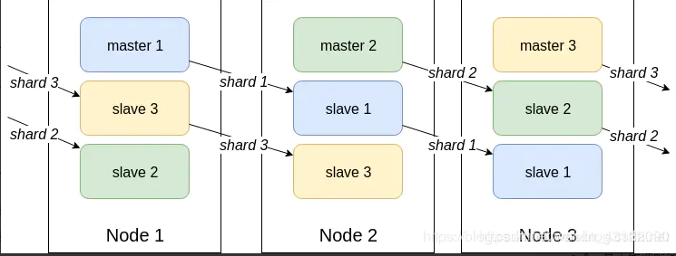
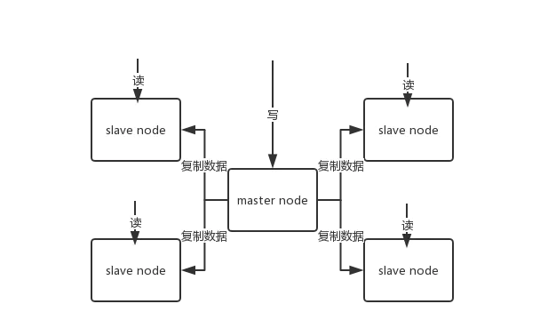
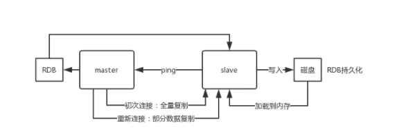

### 官方Redis Cluster 方案(服务端路由查询)





- redis 集群模式的工作原理能说一下么？在集群模式下，redis 的 key 是如何寻址的？分布式寻址都有哪些算法？了解一致性 hash 算法吗？

**简介**

- Redis Cluster是一种服务端Sharding技术，3.0版本开始正式提供。Redis Cluster并没有使用一致性hash，而是采用slot(槽)的概念，一共分成16384个槽。将请求发送到任意节点，接收到请求的节点会将查询请求发送到正确的节点上执行

**方案说明**

1. 通过哈希的方式，将数据分片，每个节点均分存储一定哈希槽(哈希值)区间的数据，默认分配了16384 个槽位
2. 每份数据分片会存储在多个互为主从的多节点上
3. 数据写入先写主节点，再同步到从节点(支持配置为阻塞同步)
4. 同一分片多个节点间的数据不保持一致性
5. 读取数据时，当客户端操作的key没有分配在该节点上时，redis会返回转向指令，指向正确的节点
6. 扩容时时需要需要把旧节点的数据迁移一部分到新节点

- 在 redis cluster 架构下，每个 redis 要放开两个端口号，比如一个是 6379，另外一个就是 加1w 的端口号，比如 16379。
  - 16379 端口号是用来进行节点间通信的，也就是 cluster bus 的东西，cluster bus 的通信，用来进行故障检测、配置更新、故障转移授权。cluster bus 用了另外一种二进制的协议，`gossip` 协议，用于节点间进行高效的数据交换，占用更少的网络带宽和处理时间。


### Redis 主从架构

- 单机的 redis，能够承载的 QPS 大概就在上万到几万不等。对于缓存来说，一般都是用来支撑**读高并发**的。因此架构做成主从(master-slave)架构，一主多从，主负责写，并且将数据复制到其它的 slave 节点，从节点负责读。所有的**读请求全部走从节点**。这样也可以很轻松实现水平扩容，**支撑读高并发**。




```
redis replication -> 主从架构 -> 读写分离 -> 水平扩容支撑读高并发
```

**redis replication 的核心机制**

- redis 采用**异步方式**复制数据到 slave 节点，不过 redis2.8 开始，slave node 会周期性地确认自己每次复制的数据量；
- 一个 master node 是可以配置多个 slave node 的；
- slave node 也可以连接其他的 slave node；
- slave node 做复制的时候，不会 block master node 的正常工作；
- slave node 在做复制的时候，也不会 block 对自己的查询操作，它会用旧的数据集来提供服务；但是复制完成的时候，需要删除旧数据集，加载新数据集，这个时候就会暂停对外服务了；
- slave node 主要用来进行横向扩容，做读写分离，扩容的 slave node 可以提高读的吞吐量。

**注意：**

- 如果采用了主从架构，那么建议必须**开启** master node 的持久化，不建议用 slave node 作为 master node 的数据热备，因为那样的话，如果你关掉 master 的持久化，可能在 master 宕机重启的时候数据是空的，然后可能一经过复制， slave node 的数据也丢了。
- 另外，master 的各种备份方案，也需要做。万一本地的所有文件丢失了，从备份中挑选一份 rdb 去恢复 master，这样才能**确保启动的时候，是有数据的**，即使采用了后续讲解的高可用机制，slave node 可以自动接管 master node，但也可能 sentinel 还没检测到 master failure，master node 就自动重启了，还是可能导致上面所有的 slave node 数据被清空。


**redis 主从复制的核心原理**

- 当启动一个 slave node 的时候，它会发送一个 `PSYNC` 命令给 master node。
- 如果这是 slave node 初次连接到 master node，那么会触发一次 `full resynchronization` 全量复制。此时 master 会启动一个后台线程，开始生成一份 `RDB` 快照文件，
- 同时还会将从客户端 client 新收到的所有写命令缓存在内存中。`RDB` 文件生成完毕后， master 会将这个 `RDB` 发送给 slave，slave 会先**写入本地磁盘，然后再从本地磁盘加载到内存**中，
- 接着 master 会将内存中缓存的写命令发送到 slave，slave 也会同步这些数据。
- slave node 如果跟 master node 有网络故障，断开了连接，会自动重连，连接之后 master node 仅会复制给 slave 部分缺少的数据。




**过程原理**


1. 当从库和主库建立MS关系后，会向主数据库发送SYNC命令
2. 主库接收到SYNC命令后会开始在后台保存快照(RDB持久化过程)，并将期间接收到的写命令缓存起来
3. 当快照完成后，主Redis会将快照文件和所有缓存的写命令发送给从Redis
4. 从Redis接收到后，会载入快照文件并且执行收到的缓存的命令
5. 之后，主Redis每当接收到写命令时就会将命令发送从Redis，从而保证数据的一致

**缺点**

- 所有的slave节点数据的复制和同步都由master节点来处理，会照成master节点压力太大，使用主从从结构来解决


### 缓存降级

- 当访问量剧增、服务出现问题（如响应时间慢或不响应）或非核心服务影响到核心流程的性能时，仍然需要保证服务还是可用的，即使是有损服务。系统可以根据一些关键数据进行自动降级，也可以配置开关实现人工降级。
- **缓存降级**的最终目的是保证核心服务可用，即使是有损的。而且有些服务是无法降级的（如加入购物车、结算）。
- 在进行降级之前要对系统进行梳理，看看系统是不是可以丢卒保帅；从而梳理出哪些必须誓死保护，哪些可降级；比如可以参考日志级别设置预案：
  1. 一般：比如有些服务偶尔因为网络抖动或者服务正在上线而超时，可以自动降级；
  2. 警告：有些服务在一段时间内成功率有波动（如在95~100%之间），可以自动降级或人工降级，并发送告警；
  3. 错误：比如可用率低于90%，或者数据库连接池被打爆了，或者访问量突然猛增到系统能承受的最大阀值，此时可以根据情况自动降级或者人工降级；
  4. 严重错误：比如因为特殊原因数据错误了，此时需要紧急人工降级。
- 服务降级的目的，是为了防止Redis服务故障，导致数据库跟着一起发生雪崩问题。因此，对于不重要的缓存数据，可以采取服务降级策略，例如一个比较常见的做法就是，Redis出现问题，不去数据库查询，而是直接返回默认值给用户。


### 如何保证缓存与数据库双写时的数据一致性？

- 你只要用缓存，就可能会涉及到缓存与数据库双存储双写，你只要是双写，就一定会有数据一致性的问题，那么你如何解决一致性问题？
- 一般来说，就是如果你的系统不是严格要求缓存+数据库必须一致性的话，缓存可以稍微的跟数据库偶尔有不一致的情况，最好不要做这个方案，读请求和写请求串行化，串到一个内存队列里去，这样就可以保证一定不会出现不一致的情况
- 串行化之后，就会导致系统的吞吐量会大幅度的降低，用比正常情况下多几倍的机器去支撑线上的一个请求。
- 还有一种方式就是可能会暂时产生不一致的情况，但是发生的几率特别小，就是**先更新数据库，然后再删除缓存。**

| 问题场景                                       | 描述                                                         | 解决                                                         |
| ---------------------------------------------- | ------------------------------------------------------------ | ------------------------------------------------------------ |
| 先写缓存，再写数据库，缓存写成功，数据库写失败 | 缓存写成功，但写数据库失败或者响应延迟，则下次读取（并发读）缓存时，就出现脏读 | 这个写缓存的方式，本身就是错误的，需要改为先写数据库，把旧缓存置为失效；读取数据的时候，如果缓存不存在，则读取数据库再写缓存 |
| 先写数据库，再写缓存，数据库写成功，缓存写失败 | 写数据库成功，但写缓存失败，则下次读取（并发读）缓存时，则读不到数据 | 缓存使用时，假如读缓存失败，先读数据库，再回写缓存的方式实现 |
| 需要缓存异步刷新                               | 指数据库操作和写缓存不在一个操作步骤中，比如在分布式场景下，无法做到同时写缓存或需要异步刷新（补救措施）时候 | 确定哪些数据适合此类场景，根据经验值确定合理的数据不一致时间，用户数据刷新的时间间隔 |


