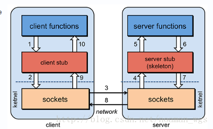

# RPC介绍

```rpc
rpc （远程过程调用）:
分布式应用中，每个模块之间都是单独的服务器，模块与模块之间的调用可以使用rpc来实现。
rpc性能由两点决定， 序列化数据速度 和 网络传输速度。
rpc执行过程：
客户端将数据进行序列化操作->网络端传输->服务端接收数据并进行反序列化->服务端通过调用接口获取结果->服务端将结果进行序列化->网络端传输->客户端接收数据并进行反序列化得到结果
通过在客户端引入一个stub类进行动态代理，隐藏网络细节、减少代码耦合性、提高可用性
rpc底层通过动态代理的方式实现调用不同的类与方法
```


# RPC原理：





## 客户端stub核心代码实现:


```java
//客户端stub核心代码实现

public static <T> T refer(final Class<T> interfaceClass, final String host, int port) throws Exception{
 
        return (T)Proxy.newProxyInstance(interfaceClass.getClassLoader(), 
                new Class<?>[]{interfaceClass},
                new InvocationHandler() {
 
                    @Override
                    public Object invoke(Object proxy, Method method, Object[] args) throws Throwable {
 
                            Socket socket = new Socket(host, port);
                            /** 先将客户端想要调用的远程服务信息及参数写入socket **/
                            ObjectOutputStream out = new ObjectOutputStream(socket.getOutputStream());
                            //方法名
                            out.writeUTF(method.getName());
                            //方法上的泛型参数
                            out.writeObject(method.getParameterTypes());
                            //调用的参数
                            out.writeObject(args);
 
                            /** 获取调用的远程服务处理的结果  **/
                            ObjectInputStream in = new ObjectInputStream(socket.getInputStream());
                            Object result = in.readObject();
 
 
                            return null;
                    }
                });
 
    }

```


## 服务端核心代码:


```java
//服务端核心代码 

/**
     * 暴露服务
     * @param service 服务实现
     * @param port 服务端口
     * @throws Exception
     */
    public static void export(final Object service, int port) throws Exception{     
        ServerSocket ss = new ServerSocket(port);
        Socket socket = ss.accept();
 
        /**  socket中读取参数等信息并反序列化封装成对象  **/
        ObjectInputStream in = new ObjectInputStream(socket.getInputStream());
        //读取一个String类型的值 ： method即为String类型的
        String methodName = in.readUTF();
        //获取方法上定义的泛型参数 
        Class<?>[] parameterTypes = (Class<?>[])in.readObject();
        //获取参数
        Object[] arguments = (Object[])in.readObject();
 
        //调用接口中所需要的方法
        Method method = service.getClass().getMethod(methodName, parameterTypes);
        //处理结果
        Object result = method.invoke(service, arguments);
 
        /** 将结果序列化写回socket **/
        ObjectOutputStream out = new ObjectOutputStream(socket.getOutputStream());
        out.writeObject(result);
 
 
 
    }
```


