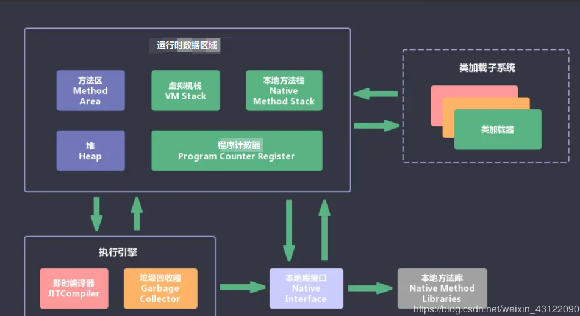
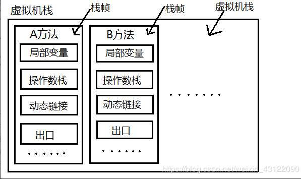
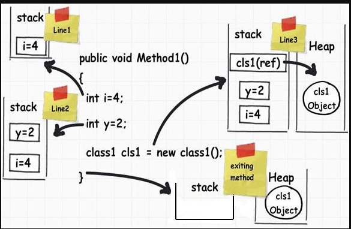
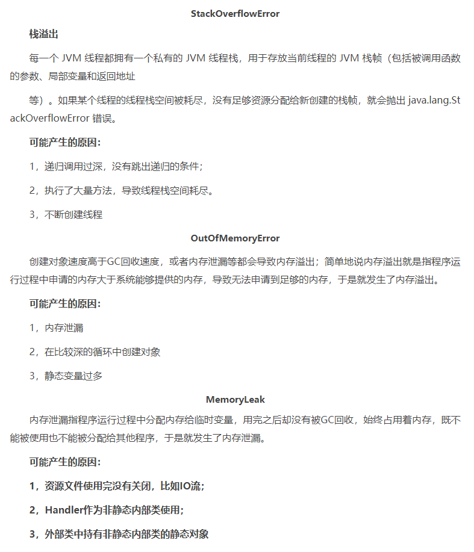
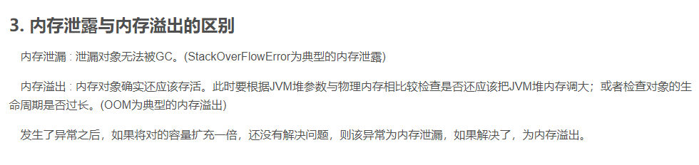

链接：https://juejin.cn/post/6844904125696573448

JVM包含两个子系统和两个组件: 两个子系统为Class loader(类装载)、Execution engine(执行引擎)； 两个组件为Runtime data area(运行时数据区)、Native Interface(本地接口)。

- Class loader(类装载)：根据给定的全限定名类名(如：java.lang.Object)来装载class文件到Runtime data area中的method area。
- Execution engine（执行引擎）：执行classes中的指令。
- Native Interface(本地接口)：与native libraries交互，是其它编程语言交互的接口。
- Runtime data area(运行时数据区域)：这就是我们常说的JVM的内存。

**流程** ：首先通过编译器把 Java 代码转换成字节码，类加载器（ClassLoader）再把字节码加载到内存中，将其放在运行时数据区（Runtime data area）的方法区内，而字节码文件只是 JVM 的一套指令集规范，并不能直接交给底层操作系统去执行，因此需要特定的命令解析器执行引擎（Execution Engine），将字节码翻译成底层系统指令，再交由 CPU 去执行，而这个过程中需要调用其他语言的本地库接口（Native Interface）来实现整个程序的功能。

### 详细的介绍下程序计数器？（重点理解）

1. 程序计数器是一块较小的内存空间，它可以看作是：保存当前线程所正在执行的字节码指令的地址(行号)

2. 由于Java虚拟机的多线程是通过线程轮流切换并分配处理器执行时间的方式来实现的，一个处理器都只会执行一条线程中的指令。因此，为了线程切换后能恢复到正确的执行位置，每条线程都有一个独立的程序计数器，各个线程之间计数器互不影响，独立存储。称之为“线程私有”的内存。程序计数器内存区域是虚拟机中唯一没有规定OutOfMemoryError情况的区域。

   

   

   ### 详细介绍下Java虚拟机栈?（重点理解）

   1. Java虚拟机是线程私有的，它的生命周期和线程相同。
   2. 虚拟机栈描述的是Java方法执行的内存模型：`每个方法在执行的同时`都会创建一个栈帧（Stack Frame）用于存储局部变量表、操作数栈、动态链接、方法出口等信息。

   - **解释**：虚拟机栈中是有单位的，单位就是**栈帧**，一个方法一个**栈帧**。一个**栈帧**中他又要存储，局部变量，操作数栈，动态链接，出口等。

   

   

   **解析栈帧：**

   

   1. 局部变量表：是用来存储我们临时8个基本数据类型、对象引用地址、returnAddress类型。（returnAddress中保存的是return后要执行的字节码的指令地址。）
   2. 操作数栈：操作数栈就是用来操作的，例如代码中有个 i = 6*6，他在一开始的时候就会进行操作，读取我们的代码，进行计算后再放入局部变量表中去
   3. 动态链接：假如我方法中，有个 service.add()方法，要链接到别的方法中去，这就是动态链接，存储链接的地方。
   4. 出口：出口是什呢，出口正常的话就是return  不正常的话就是抛出异常落

   

   

   ### 你能给我详细的介绍Java堆吗?（重点理解）

   - java堆（Java Heap）是java虚拟机所管理的内存中最大的一块，是被所有线程共享的一块内存区域，在虚拟机启动时创建。此内存区域的唯一目的就是存放对象实例。
   - 在Java虚拟机规范中的描述是：所有的对象实例以及数组都要在堆上分配。
   - java堆是垃圾收集器管理的主要区域，因此也被成为“GC堆”。
   - 从内存回收角度来看java堆可分为：新生代和老生代。
   - 从内存分配的角度看，线程共享的Java堆中可能划分出多个线程私有的分配缓冲区。
   - 无论怎么划分，都与存放内容无关，无论哪个区域，存储的都是对象实例，进一步的划分都是为了更好的回收内存，或者更快的分配内存。
   - 根据Java虚拟机规范的规定，java堆可以处于物理上不连续的内存空间中。当前主流的虚拟机都是可扩展的（通过 -Xmx 和 -Xms 控制）。如果堆中没有内存可以完成实例分配，并且堆也无法再扩展时，将会抛出OutOfMemoryError异常。

   

   

   ### 能不能解释一下方法区（重点理解）

   1. 方法区是所有线程共享的内存区域，它用于存储已被Java虚拟机加载的类信息、常量、静态变量、即时编译器编译后的代码等数据。
   2. 它有个别命叫Non-Heap（非堆）。当方法区无法满足内存分配需求时，抛出OutOfMemoryError异常。

   

   ### 你听过直接内存吗？

   - 直接内存（Direct Memory）并不是虚拟机运行时数据区的一部分，也不是Java虚拟机中定义的内存区域。但是这部分内存也被频繁地使用，而且也可能导致 OutOfMemoryError 异常出现，所以我们放到这里一起讲解。
   - 我的理解就是直接内存是基于物理内存和Java虚拟机内存的中间内存

   

   

   

   

