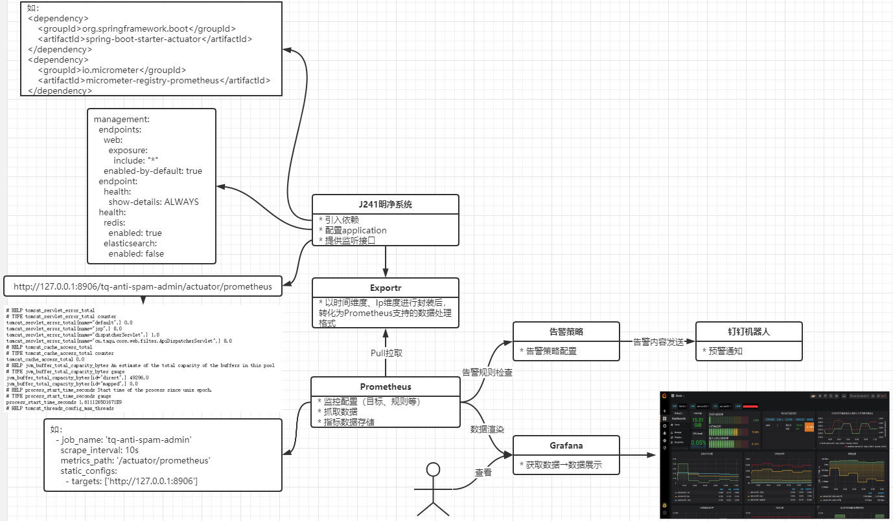

通过 **Prometheus** 对各个系统的访问流量进行监控统计




**SpringBoot：**

1. 配置基于Actuator的prometheus监控，提供监控的接口(不要有权限校验)：`http://127.0.0.1:8906/tq-anti-spam-admin/actuator/prometheus`。
2. 分析需要监听的监控指标，封装prometheus采集需要的格式，并提交到监控接口中。

**Prometheus：**

1. 监控配置（目标、规则、拉取频率等）。
   抓取的周期和时间主要看指标的关键程度


采用：访问Ip、提交时间戳（精确到分）、请求者Ip、请求地址、请求方式(Get/Post)、响应状态。拆分了六个维度去进行监控。


(目前的实现如下，可能还有许多地方需要改进)

1. 由于要先提前定义好指标，才能在InitPrometheus下提交到监控端口中。所以需要在

   ```
   MyMetrics
   ```

   下定义基于Gauge的自定义指标（可以动态获取项目名，方便后续扩展）

   ```
   1.静态代码块调用获取yml配置值的工具类，处理后赋给projectName，作为指标名
   2.根据访问Ip、提交时间戳（精确到分）、请求者Ip、请求地址、请求方式(Get/Post)、响应状态，实例化Gauge。
   3.submit()方法在每次调用的时候再对应的标签下累加一次值，其中调用到的getLocalIp()通过java.net包实现，获取当前ip
   ```

2. `InitPrometheus`继承了`ApplicationListener<ContextRefreshedEvent>`,在初始化的时候将Metrics标签注册到暴露给Prometheus监听的端口上。

3. `PrometheusSubmitFilter`提交过滤器，过滤掉静态资源路径下的请求、获取Metrics标签对应的参数值（涉及到自定义工具类`GetIpAddressUtil`）。并调用MyMetrics的submit()方法。

4. 将该拦截器注册到`CommonConfiguration`中。


```xml

		 <dependency>
            <groupId>org.springframework.boot</groupId>
            <artifactId>spring-boot-starter-actuator</artifactId>
        </dependency>
        <dependency>
            <groupId>io.micrometer</groupId>
            <artifactId>micrometer-registry-prometheus</artifactId>
        </dependency>
<!-- The client -->
        <dependency>
            <groupId>io.prometheus</groupId>
            <artifactId>simpleclient</artifactId>
            <version>0.9.0</version>
        </dependency>
        <!-- Hotspot JVM metrics-->
        <dependency>
            <groupId>io.prometheus</groupId>
            <artifactId>simpleclient_hotspot</artifactId>
            <version>0.9.0</version>
        </dependency>
        <!-- Exposition HTTPServer-->
        <dependency>
            <groupId>io.prometheus</groupId>
            <artifactId>simpleclient_httpserver</artifactId>
            <version>0.9.0</version>
        </dependency>
        <!-- Pushgateway exposition-->
        <dependency>
            <groupId>io.prometheus</groupId>
            <artifactId>simpleclient_pushgateway</artifactId>
            <version>0.9.0</version>
        </dependency>
```


```java
package cn.taqu.antispam.admin.common.prometheus;

import cn.taqu.antispam.admin.common.utils.GetYmlPropertiesUtil;
import io.prometheus.client.Gauge;
import lombok.extern.slf4j.Slf4j;
import org.slf4j.Logger;
import org.slf4j.LoggerFactory;

import java.net.InetAddress;
import java.net.UnknownHostException;
import java.util.Iterator;
import java.util.Map;
import java.util.concurrent.ConcurrentSkipListMap;

/**
 * 描述：Gauge实现的自定义标签、指标  （Counter没有set()方法）
 * 当Prometheus获取实例的HTTP端点时，客户库发送所有跟踪的度量指标数据到服务器上。而要做的则是在跟踪时做一些缓存。
 * 在时间维度下，对ip、localIp进行缓存处理; 原先的path、method、code维度改从自带的标签http_server_requests_seconds_count中查看。
 *
 * @author CaiTianXin
 * @date 2021/03/01
 */
@Slf4j
public class MyMetrics {
    private static final Logger logger = LoggerFactory.getLogger(MyMetrics.class);

    /**
     * ConcurrentSkipListMap：有序的哈希表，线程安全，通过跳表实现。（key有序、支持高并发）
     * ######
     * ConcurrentSkipListMap<String, ConcurrentSkipListMap<String, Integer>>;
     * ↓
     * timeMap<{time}, ipMap<String, Integer>>>;
     */
    private static Map<Object, Object> map = new ConcurrentSkipListMap<>();

    /**
     * 项目名，采用动态获取避免写死在一个系统
     * 格式：xxx_tps
     */
    public static String projectName;

    /**
     * 通过自定义工具类获取到application.yml上的service.code
     */
    static {
        projectName = GetYmlPropertiesUtil.getCommonYml("service.code") + "_tps";
    }

    /**
     * 指标：{projectName}_tps
     * 标签：ip、time、localIp
     * 格式：antispam_v2_tps{ip="127.0.0.1",time="202103020943",localIp="10.10.10.234",} 2.0
     */
    public static Gauge baseGauge = Gauge.build()
            .name(projectName)
            .labelNames("ip", "time", "localIp")
            .help("Three metric for this label.")
            .register();

    /**
     * 缓存一次累加请求
     *
     * @param time 时间戳
     * @return boolean
     */
    public static synchronized void increase(String ip, String time) {
        ConcurrentSkipListMap timeMap = (ConcurrentSkipListMap)map.get(projectName);
        if (timeMap != null) {
            ConcurrentSkipListMap<String, Integer> ipMap = (ConcurrentSkipListMap)timeMap.get(time);
            if (ipMap != null) {
                tpsIncrease(ip, ipMap);
            } else {
                initIpMap(time, ip, timeMap);
            }
        } else {
            timeMap = new ConcurrentSkipListMap();
            initIpMap(time, ip, timeMap);
            map.put(projectName, timeMap);
        }
    }

    /**
     * tps增加1
     *
     * @param ip    ip
     * @param ipMap ipMap
     */
    private static void tpsIncrease(String ip, ConcurrentSkipListMap<String, Integer> ipMap) {
        Integer tps = ipMap.get(ip);
        if (tps == null) {
            tps = 0;
        }

        tps = tps + 1;
        ipMap.put(ip, tps);
    }

    /**
     * 初始化ipMap
     *
     * @param time    时间戳
     * @param ip      ip
     * @param timeMap tumeMap
     */
    private static void initIpMap(String time, String ip, ConcurrentSkipListMap timeMap) {
        ConcurrentSkipListMap<String, Integer> ipMap = new ConcurrentSkipListMap<>();
        ipMap.put(ip, 1);
        timeMap.put(time, ipMap);
    }

    /**
     * 将时间戳前的缓存提交并清空
     *
     * @param time 时间
     * @return boolean
     */
    public static boolean submit(String time) {
        // 获取到当前ip，如果ip获取失败，该方法直接当成成功返回。
        String localIp = getLocalIp();
        if (localIp == null) {
            return true;
        }

        ConcurrentSkipListMap projMap = (ConcurrentSkipListMap)map.get(projectName);
        if (projMap != null && projMap.size() > 0) {
            boolean first = true;
            while(true) {
                Map.Entry<String, ConcurrentSkipListMap<String, Integer>> timeMap = projMap.floorEntry(time);
                if (timeMap == null) {
                    // 若是第一次，则返回false
                    return !first;
                }
                first = false;

                Iterator iterator = ((ConcurrentSkipListMap)timeMap.getValue()).entrySet().iterator();

                while(iterator.hasNext()) {
                    Map.Entry tpsEle = (Map.Entry)iterator.next();
                    String ip = (String)tpsEle.getKey();
                    Integer tps = (Integer)tpsEle.getValue();
                    baseGauge.labels(ip, timeMap.getKey(), localIp).set(tps);
                }
                projMap.remove(timeMap.getKey());
            }
        } else {
            logger.warn("{} no request", time);
            return false;
        }
    }

    /**
     * 通过java.net包获取当前ip
     *
     * @return String
     */
    private static String getLocalIp() {
        String localIp = null;

        try {
            localIp = InetAddress.getLocalHost().getHostAddress();
        } catch (UnknownHostException var2) {
            log.error("localip error");
        }

        return localIp;
    }
}
```

```java
@Component
public class InitPrometheus implements ApplicationListener<ContextRefreshedEvent> {

    @Resource
    PrometheusMeterRegistry meterRegistry;

    /**
     * 将Metrics标签注册到暴露给Prometheus监听的端口上
     */
    @Override
    public void onApplicationEvent(ContextRefreshedEvent event) {
        CollectorRegistry prometheusRegistry = meterRegistry.getPrometheusRegistry();
        prometheusRegistry.register(MyMetrics.baseGauge);
    }
}
```

```java
public class PrometheusSubmitFilter implements Filter {

    @Override
    public void doFilter(ServletRequest request, ServletResponse response, FilterChain chain) throws IOException, ServletException {
        HttpServletRequest req = (HttpServletRequest) request;
        SimpleDateFormat simpleDateFormat = new SimpleDateFormat("yyyyMMddHHmm");
        String requestUri = req.getRequestURI();
        String time = simpleDateFormat.format(new Date());
        // 如果访问的是该暴露的页面才提交
        if (requestUri.contains("/actuator/prometheus")) {
            MyMetrics.submit(time);
            // 过滤静态文件
        }else if (!requestUri.contains("/static/")) {
            String ip = GetIpAddressUtil.getIpAddr(req);
            MyMetrics.increase(ip, time);
        }
        chain.doFilter(request, response);
    }
}
```

```java
public class GetIpAddressUtil {

    /**
     * 获取访问地址的Ip
     * @param request HttpServletRequest
     * @return String
     */
    public static String getIpAddr(HttpServletRequest request) {
        String ip = request.getHeader("X-Real-IP");
        if (StringUtils.isEmpty(ip)) {
            ip = request.getHeader("x-forwarded-for");
        }

        if (!StringUtils.isEmpty(ip)) {
            String[] lst = ip.split(",");
            if (lst.length > 0) {
                ip = lst[0];
            } else {
                ip = null;
            }
        }

        if (ip == null || ip.length() == 0 || "unknown".equalsIgnoreCase(ip)) {
            ip = request.getHeader("Proxy-Client-IP");
        }

        if (ip == null || ip.length() == 0 || "unknown".equalsIgnoreCase(ip)) {
            ip = request.getHeader("WL-Proxy-Client-IP");
        }

        if (ip == null || ip.length() == 0 || "unknown".equalsIgnoreCase(ip)) {
            ip = request.getRemoteAddr();
        }

        return ip;
    }
}
```


#### Actuator的prometheus监控指标分析

可能对流量监控有用的参数：

```
# 请求总次数
http_server_requests_seconds_count{exception="None",method="GET",outcome="SUCCESS",status="200",uri="/index",} 2.0
# 总共花了多长时间
http_server_requests_seconds_sum{exception="None",method="GET",outcome="SUCCESS",status="200",uri="/index",} 0.8098944
# 最长一次花费多久
http_server_requests_seconds_max{exception="None",method="GET",outcome="SUCCESS",status="200",uri="/index",} 0.6628419

# tomcat配置的线程最大数
tomcat_threads_config_max_threads{name="http-nio-8906",} NaN
# tomcat当前线程数（包括守护线程）
tomcat_threads_current_threads{name="http-nio-8906",} NaN
# tomcat繁忙线程
tomcat_threads_busy_threads{name="http-nio-8906",} NaN

# JVM守护线程数
jvm_threads_daemon_threads 237.0
# JVM当前活跃线程数
jvm_threads_live_threads 343.0
# JVM峰值线程数
jvm_threads_peak_threads 345.0
```