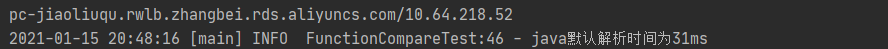
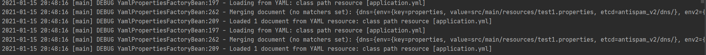
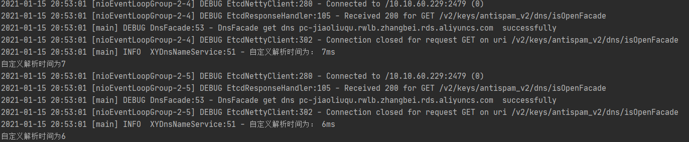
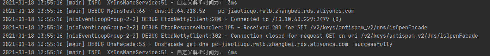

性能：

1.    使用自定义解析器的缓存 与 使用默认解析方法的缓存 对比    √

   域名个数、      时间计算？ 压力测试？

2.    使用自定义解析器 缓存是否开启的对比     

3.    使用自定义解析器远程与默认解析器远程解析的对比   √

   

​    

1. Java默认dns解析器解析dns时，若域名配置出现问题，导致无法解析，则会在

业务访问该域名时出现 unknownhost 异常，影响业务流程。

自定义解析器  使用了定时任务对dns域名缓存进行检查，可在业务访问之前提前打

出错误日志警告提醒域名配置问题。

2. Java默认dns解析器 无法判定是dns服务器还是单个域名出现问题，当dns服务器

解析出错时，它依旧会对所有需要解析的域名进行解析，虽然有负向缓存，但过期后依

旧会远程解析，这是不必要的。

自定义解析器  在定时任务中，会检测出是单个域名问题还是dns服务器解析问题，当

发现是dns服务器问题时，打印错误日志警告，暂停定时任务一段时间，停止所有远程

解析处理。(降级策略)

3. Java默认dns解析器 所有dns缓存时长都一样，无法根据特定类型dns指定时长

自定义解析器 可通过设置不同类型dns定时任务间隔时长更新检查缓存。如较为稳定

不易变更的域名可设置相应较长的检查时间间隔

   

本机dns存在缓存，远程调用解析可能会使用电脑本地缓存

​	

